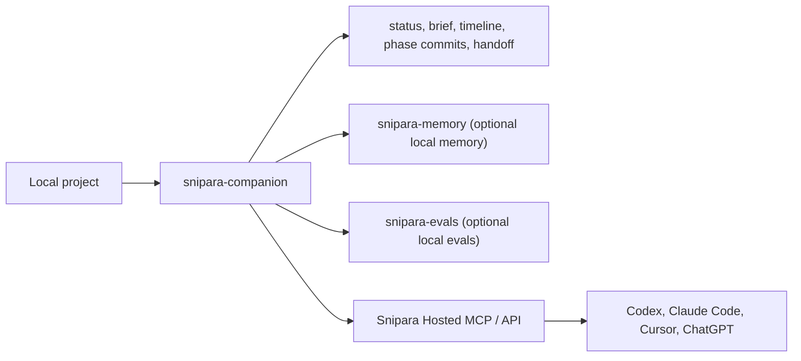

# snipara-companion

**Local helper CLI for Snipara agent workflows.**

`snipara-companion` adds Git-style continuity commands for agent work: status,
briefs, timelines, phase commits, handoffs, resume, diagnostics, hooks, folder
onboarding, local Mini Snipara bridges, and command-line access around Snipara
Hosted MCP. It complements the hosted context and memory surface; it is not the
primary runtime for agents.

In this standalone repository, the source lives in `src`, and the installed executable is `snipara-companion`.

This package complements `snipara-mcp`. It does not replace it.



## Mini Snipara Open Stack

`snipara-companion` is the local workflow layer in the open Mini Snipara stack:

| Repo                                                                | Role                                                                                                            | Account required                         |
| ------------------------------------------------------------------- | --------------------------------------------------------------------------------------------------------------- | ---------------------------------------- |
| [`snipara-companion`](https://github.com/Snipara/snipara-companion) | Local workflow continuity, hooks, handoffs, and hosted bridges                                                  | No for local state; yes for hosted calls |
| [`snipara-memory`](https://github.com/Snipara/snipara-memory)       | Local durable project memory engine and MCP/API wrapper                                                         | No                                       |
| [`snipara-evals`](https://github.com/Snipara/snipara-evals)         | Deterministic Project Intelligence evals for handoffs, context, decisions, impact, verification, and continuity | No                                       |

Hosted Snipara remains the managed layer for source authority, reviewed memory,
team-wide presence, shared claims/locks, conflict alarms, GitHub checks,
dashboard live views, and Cloud code graph impact. Local commands are useful for
single-machine continuity and CI artifacts, but they cannot prove what another
human or agent is doing on a different machine unless the hosted collaboration
backend is configured.

## Operating Modes

`snipara-companion` is designed to remain useful at three levels:

| Mode | Account required | What works |
| ---- | ---------------- | ---------- |
| Standalone local | No | Workflow files, timeline, handoffs, local status, hooks, smoke checks, and CI-friendly artifacts |
| Local memory stack | No | Everything above plus `snipara-companion memory local -- <args...>` through `snipara-memory` |
| Snipara SaaS | Yes | Hosted context, reviewed memory, Team Sync, collaboration guards, shared claims, dashboards, and cloud code graph |

The CLI should not require Snipara SaaS for local continuity. Hosted calls should
enrich local workflows when credentials are present and degrade to local records
when they are not.

## Local vs Hosted Capabilities

| Capability                                   | Local/open stack                   | Hosted Snipara                              |
| -------------------------------------------- | ---------------------------------- | ------------------------------------------- |
| Workflow state, timeline, handoff files      | Yes                                | Syncs and enriches when configured          |
| Local project memory                         | Via `snipara-memory`               | Managed, reviewed, scoped memory            |
| Project Intelligence eval artifacts          | Via `snipara-evals`                | Can use hosted context/code graph as inputs |
| Git hooks and local guards                   | Yes                                | Stronger with hosted guard decisions        |
| Presence across machines and agents          | No                                 | Yes                                         |
| Shared claims/locks and stale lease handling | Local only is advisory             | Yes                                         |
| GitHub checks and dashboard live views       | No                                 | Yes                                         |
| Code graph impact and symbol cards           | Local overlay only where available | Cloud code graph                            |

## When To Use It

| If you need...                                            | Install...               |
| --------------------------------------------------------- | ------------------------ |
| MCP tools, OAuth login, project-scoped context and memory | `snipara-mcp`            |
| One-command Hosted MCP + companion setup                  | `create-snipara`         |
| Git-style local continuity, workflow modes, and hooks     | `snipara-companion`      |
| Production gates, drift checks, and htask orchestration   | `snipara-orchestrator`   |
| OpenClaw-specific automation hooks                        | `snipara-openclaw-hooks` |

### Codex Note

For Codex, the primary integration remains Hosted MCP plus `AGENTS.md`.

- `create-snipara` installs `snipara-companion` by default for managed workflow commands.
- `snipara-companion` is still skippable with `--profile hosted-only` or `--skip-companion`.
- Use it when compaction-safe phase commits, Project Intelligence briefs, local doctor checks, or shared helper workflows are useful.
- Use `workflow scaffold --preset project-intelligence-continuity-layer` for roadmap-sized Project Intelligence work that needs phase commits.
- If an agent session exposes only a subset of Snipara tools, use `snipara_help(list_all=true)` in that session before concluding a tool is unavailable.

## Configuring MCP Tool Surfaces

The MCP server advertises different tool surfaces depending on the `SNIPARA_EXPOSED_SURFACES` environment variable. Hosted MCP defaults to inline tools plus a small companion maintenance set for index health, reindexing, and read-only memory hygiene. To expose all companion tools directly in the advertised manifest, set `SNIPARA_EXPOSED_SURFACES=inline,companion` on the MCP server. Remaining companion tools are discoverable via `snipara_help` and can be executed by direct JSON-RPC or clients/server configurations that expose those surfaces. Standard MCP agents only receive schemas for tools returned by `tools/list`.

## Installation

```bash
npm install -g snipara-companion
# or
pnpm add -g snipara-companion
# or
yarn global add snipara-companion
```

## Installed Command

```bash
snipara-companion
```

## Development

```bash
pnpm install
pnpm lint
pnpm type-check
pnpm test
pnpm pack:smoke
```

This standalone repository mirrors the Snipara monorepo package source. The npm
package is `snipara-companion`.

## New In 1.4.9

- `snipara-companion team-sync start-work` now reports whether the hosted Start
  Work Brief loaded, so local-only runs stay clear and SaaS-enriched runs show
  their hosted context status.
- Keeps Team Sync local-first: without hosted credentials, start-work still
  records local intent; with `snipara-memory`, local memory workflows remain
  available; with Snipara SaaS, hosted briefs enrich the same local workflow.

## New In 1.4.8

- Adds `snipara-companion collaboration guard --ack-review-only` so enforced
  release guards can acknowledge review-only stale-state and
  decision-consistency warnings without requiring
  `SNIPARA_COLLABORATION_GUARD=0`. The hosted `REVIEW_REQUIRED` verdict stays
  visible in the guard payload; `BLOCKED`, `REQUIRES_ACK`, active-session
  conflicts and blocking leases still fail.
- Updates the Infomaniak deploy guard to use the review-only ack path for
  release UX false positives while keeping the emergency env bypass reserved for
  true guard outages.

## New In 1.4.7

- Adds `snipara-companion workflow impact-gate` for committed local workflow
  phases that are ahead of upstream but not pushed yet. It compares
  `upstream..HEAD`, separates dirty working-tree files, runs local code-overlay
  impact on the committed code files, and maps the result back to completed
  workflow phases.

## New In 1.4.6

- Adds outcome-weighted next actions in Team Sync briefs when hosted context
  returns prioritized follow-up actions.
- Compacts large hosted collaboration guard payloads before sending them to the
  API so large local diffs do not overflow request limits.
- Keeps blocking collaboration hooks on the installed `snipara-companion`
  binary instead of falling back to `npx @latest` inside Git hooks.

## New In 1.4.5

- `workflow phase-commit` and `workflow final-commit` now complete matching
  local Team Sync work items when the workflow outcome is completed.
- Matching stays conservative: workflow-goal text wins, and file/token fallback
  is only used when no workflow goal is available, so deploy or promotion
  threads are not closed from implementation evidence alone.
- Text output now reports completed Team Sync work when workflow commits clean up
  local active items.

## New In 1.4.4

- Adds `snipara-companion memory local -- <args...>` as a thin bridge to the
  open `snipara-memory` engine for no-account local memory workflows.
- Adds `snipara-companion eval export` to write a `snipara-evals` case from
  local workflow, Team Sync, file, command, and expected-signal inputs.
- Adds `snipara-companion eval run` to execute `snipara-evals` through `npx` or a
  configured local runner.
- Clarifies the open Mini Snipara stack boundary: local continuity and evals are
  open, while team-wide presence, shared locks, GitHub checks, dashboards, and
  Cloud code graph remain hosted Snipara capabilities.

## New In 1.4.2

- Adds `snipara-companion collaboration start|watch|claim|guard|release|status`
  for safe parallel coding presence, auto-claims, advisory/exclusive resource
  claims, hosted guard checks, and conflict alarms across humans and agents.
- Adds `snipara-companion collaboration hooks install` plus guard profiles for
  blocking pre-commit, pre-push, pre-deploy, schema/migration, and package
  release checks.
- Adds `snipara-companion collaboration ide-status` for editor extensions and
  local companion UIs that need compact live collaboration state.
- Hardens local code impact so stale or incomplete local overlay caches report
  missing target files instead of silently returning an empty impact set.

## New In 1.4.1

- Makes local code overlay Git hooks background by default so `git commit` and
  `git push` return quickly while Snipara refreshes local overlay state and
  push-time promotion asynchronously.
- Adds `snipara-companion code hooks install --synchronous` for teams that
  intentionally want foreground hook work, plus a configurable background
  reindex delay for pre-push promotion.

## New In 1.3.7

- Hardens `memory-guard check` with `--confirmed-by-user "<confirmation>"`
  for explicit, auditable overrides after the user has reviewed destructive or
  contradictory signals.
- Adds stable guard exit codes in strict mode: `20` for confirmation required,
  `21` for unavailable memory/context guidance, and `22` for invalid guard
  options.
- Validates destructive checks before hosted calls so vague commands such as
  `--destructive` without `--intent` or `--command` fail fast.
- Extends `snipara-companion init --with-hooks` so it also installs local code
  overlay Git hooks (`post-commit` sync and `pre-push` promotion/reindex).

## New In 1.3.6

- Adds `snipara-companion memory audit` for a read-only memory hygiene pass that
  combines hosted memory health, cleanup candidates, and compaction dry-run.
- Adds `memory health`, `memory clean-candidates`, and `memory compact` as
  direct companion maintenance commands. `memory compact` always sends
  `dry_run=true` and does not mutate memory.
- Extends `memory-guard check` with `--intent`, `--destructive`, and
  `--require-confirmation` so agents can surface memory/context contradictions
  and ask the user before irreversible actions.

## New In 1.3.0

- Adds top-level Git-style agent work commands: `status`, `brief`, `timeline`,
  `verify`, `handoff`, and `workflow resume`.
- Adds `snipara-companion verify` for transparent verification plans based on
  `snipara_code_impact` plus local package scripts.
- Reframes companion as the day-two continuity surface after
  `npx create-snipara` installs the project.

## New In 1.2.0

- Adds `snipara-companion intelligence brief` for a local Project Intelligence brief that composes hosted resume context, memory health, and code impact into one agent-ready output.
- Adds `workflow scaffold --preset project-intelligence-continuity-layer` for the full memory + code graph + workflow continuity roadmap.
- Updates generated agent workflow instructions so new work can call the Project Intelligence brief before risky changes and scaffold the roadmap preset for multi-phase delivery.

## Agentic Work Commands

`create-snipara` gets the project connected. `snipara-companion` keeps long
agent sessions resumable. Install once with `npx create-snipara`; continue every
session with `snipara-companion`:

```bash
snipara-companion status
snipara-companion brief --task "ship auth hardening" --changed-files src/auth.ts
snipara-companion timeline
snipara-companion workflow phase-commit build --summary "tests green"
snipara-companion workflow impact-gate
snipara-companion verify --changed-files src/auth.ts --diff-summary "auth hardening"
snipara-companion handoff --summary "status command shipped" --next "publish package"
snipara-companion workflow resume --include-session-context
```

- `status` is the Git-style local work status: workflow phase, latest phase
  commit, git dirtiness, Team Sync handoffs, local risks, and next action.
- `brief` is the short alias for `intelligence brief`.
- `timeline` is the Git-style log for workflow starts, phase starts, phase
  commits, final commits, and Team Sync handoffs.
- `workflow impact-gate` audits committed local workflow phases that are ahead
  of upstream but not pushed. It does not push, and dirty working-tree files are
  reported separately from the committed diff.
- `verify` builds a transparent verification plan from `snipara_code_impact`
  signals plus local package scripts. It recommends checks; it does not claim to
  execute them.
- `handoff` writes an agent-ready handoff artifact while persisting the same
  local/hosted Team Sync continuity record as `team-sync handoff`.

The mental model is intentionally close to Git:

| Git habit             | Companion command                         |
| --------------------- | ----------------------------------------- |
| `git status`          | `snipara-companion status`                |
| `git show`            | `snipara-companion brief`                 |
| `git commit`          | `snipara-companion workflow phase-commit` |
| `git diff @{u}..HEAD` | `snipara-companion workflow impact-gate`  |
| `git log`             | `snipara-companion timeline`              |
| `git format-patch`    | `snipara-companion handoff`               |
| `git checkout`        | `snipara-companion workflow resume`       |

`snipara-companion final-commit` closes the local workflow and asks the hosted
API only for the final Team Sync handoff. The CLI sends a compact summary with a
longer timeout, retries once with a shorter summary on transient hosted failures,
and then records a local fallback handoff in `.snipara/team-sync/session.json`
if the hosted call still times out. A hosted final-commit timeout does not modify
Git state. Custom final-commit categories are namespaced under `final-commit`
before the hosted call so they stay on the handoff-only path.

## Verification Plans

Use `verify` when an agent asks what to prove before handoff or release:

```bash
snipara-companion verify --changed-files src/auth.ts tests/auth.test.ts --diff-summary "auth hardening"
snipara-companion verify --file-path src/auth.ts --json
snipara-companion verify --skip-impact --changed-files src/auth.ts
```

Output includes:

- recommended checks from code impact and local package scripts
- impacted files
- risk level and score when code impact is available
- missing checks and caveats
- suggested next commands

## New In 1.1.15

- Expands `init --client` to Claude Code, Cursor, Windsurf, Codex, Gemini, Mistral, ChatGPT, VS Code, Continue, and custom MCP clients.
- Keeps Claude Code, Cursor, and Windsurf as hook-capable presets while treating Mistral, ChatGPT, VS Code, Continue, and custom clients as MCP-first setup presets.
- Prints Codex TOML or HTTP MCP references for MCP-first clients instead of generating unsupported legacy hooks.

## New In 1.1.14

- Adds `npx -y snipara-companion@latest automations install/status/diff/update` for installing dashboard-generated automation hook bundles locally.
- `init --with-hooks` now delegates hook installation to the hosted automation config bundle so Claude Code, Cursor, and Windsurf use the same templates as Project Automation.
- Managed automation files are tracked in `.snipara/automations/manifest.json` and are not overwritten after local edits unless `--force` is used.
- Automation REST calls now use `www.snipara.com` while MCP calls stay on `api.snipara.com`, avoiding FastAPI IP rate limits on Stuck Guard and generated hook installs.

## New In 1.1.13

- Adds `snipara-companion stuck-guard status/check/simulate` for hosted Memory Guard / Stuck Guard decisions.
- `pre-tool` now emits canonical `tool_call` events and prints Rescue Packs when hosted Stuck Guard returns `inject` or `enforce`.
- `post-tool` now emits canonical `tool_result` events with status, exit code, command, classification, and a redacted/truncated preview.

## New In 1.1.12

- Documents the GitHub PR Answer Packs boundary: use `create-snipara --github`
  for the hosted GitHub App setup, and use `snipara-companion` only for local
  planning, code impact checks, workflow state, and memory commits.

## New In 1.1.10

- Snipara Sandbox guidance now points existing projects to `npx create-snipara repair --with-runtime`
- Managed workflow phases marked `needs_runtime` suggest Snipara Sandbox installation only when needed

## New In 1.1.4

- `snipara-companion onboard-folder` previews and applies dashboardless business-folder imports from local or LLM-materialized sources
- `snipara-companion workflow start/status/resume/phase-start/phase-commit` keeps a visible LLM plan in `.snipara/workflow/current.json` and persists each phase through hosted memory so compacted agents can resume safely
- `snipara-companion final-commit` persists the final workflow outcome with `snipara_end_of_task_commit`
- `snipara-companion code symbol-card` and `snipara-companion code impact` expose paid Context safeguards directly from the companion CLI

## New In 1.1.2

- `snipara-companion doctor` and Snipara Sandbox hints detect provider keys from local `.env` files without printing secret values

## New In 1.1.1

- `snipara-companion doctor` diagnoses Snipara auth, Snipara Sandbox, Snipara Sandbox MCP, provider keys, and Docker
- `workflow run` prints contextual Snipara Sandbox hints for full/orchestrated/execution-heavy work
- `workflow run --no-runtime-hint` hides Snipara Sandbox guidance for scripted terminal output

## New In 1.1.0

- `business-collections` commands for Team Business Context presets and reusable business docs
- `client-projects` commands for creating and listing project-scoped client context workspaces
- `upload --metadata/--metadata-file` plus convenience metadata flags for single-file business/client uploads

## New In 1.0.0

- direct `snipara-companion code` access for `callers`, `imports`, `neighbors`, and `shortest-path`
- `workflow run --mode lite|standard|full|orchestrate` for hosted-first workflow routing; `auto` remains a STANDARD compatibility alias
- `snipara-companion shared-context` for project-linked standards and team guidance
- automatic fallback to project token auth when a stale `SNIPARA_API_KEY` overrides a valid local login

## Supported Client Presets Today

The built-in `init` and `automations` flows share these client names:

- `claude-code`
- `cursor`
- `windsurf`
- `codex`
- `gemini`
- `mistral`
- `chatgpt`
- `vscode`
- `continue`
- `custom`

Claude Code, Cursor, Windsurf, Codex, and Gemini have native or generated hook
surfaces. Mistral, ChatGPT, VS Code, Continue, and custom clients are MCP-first presets: companion
prints the hosted MCP config/reference and installs dashboard-generated
automation files only when the hosted project exposes a bundle for that client.

## Quick Start

### Claude Code

```bash
npx -y snipara-companion@latest init --with-hooks --client claude-code
```

### Cursor

```bash
npx -y snipara-companion@latest init --with-hooks --client cursor
```

### Windsurf

```bash
npx -y snipara-companion@latest init --with-hooks --client windsurf
```

### Codex

```bash
npx -y snipara-companion@latest init --client codex
```

### Gemini Or Other MCP Clients

```bash
npx -y snipara-companion@latest init --client gemini
npx -y snipara-companion@latest init --client mistral
npx -y snipara-companion@latest init --client vscode
npx -y snipara-companion@latest init --client continue
npx -y snipara-companion@latest init --client custom
```

### Dashboard-Generated Automations

Use `automations install` when you want the local project to match the hook
bundle generated by Project Automation in the dashboard:

```bash
npx -y snipara-companion@latest automations install --client claude-code
npx -y snipara-companion@latest automations install --client cursor
npx -y snipara-companion@latest automations install --client windsurf
npx -y snipara-companion@latest automations install --client codex
npx -y snipara-companion@latest automations status
npx -y snipara-companion@latest automations diff
npx -y snipara-companion@latest automations update
```

The companion fetches the current project bundle from the hosted dashboard API,
writes the generated files, and tracks them in
`.snipara/automations/manifest.json`. Generated scripts read the API key from
`SNIPARA_API_KEY` or the existing companion config created by
`create-snipara`/`npx -y snipara-companion@latest init`; the install flow does not prompt for
or embed a second key. Managed files are not overwritten after local edits
unless you pass `--force`.

Agent instruction files are always merged, not replaced. Existing `AGENTS.md`,
`CLAUDE.md`, `GEMINI.md`, `.cursorrules`, and Copilot instructions keep their
local content while Snipara adds or refreshes a marked Snipara section. Known
client JSON configs for Claude, Cursor, Continue.dev, Windsurf, Gemini, VS Code,
and root `mcp.json` are deep-merged so existing servers and hooks are preserved.
Mistral generates MCP-first files (`MISTRAL.md`, Vibe config, Le Chat connector
reference, and LangChain `ChatMistralAI.bindTools` snippets); Mistral request
hooks are model request hooks, not local agent lifecycle hooks.

OpenClaw hooks remain separate:

```bash
npx snipara-openclaw-hooks install
```

## Commands

### `snipara-companion init`

Initialize local configuration and optionally generate client hook files.

```bash
npx -y snipara-companion@latest init
```

Options:

- `--api-key <key>` - Skip prompt for API key
- `--project <project>` - Skip prompt for project slug or ID
- `--project-id <id>` - Deprecated alias for `--project`
- `--client <client>` - `claude-code`, `cursor`, `windsurf`, `codex`, `gemini`, `chatgpt`, `vscode`, `continue`, or `custom`
- `--with-hooks` - Install hooks automatically
- `--force` - Overwrite existing generated files
- `--dir <directory>` - Target directory for generated files

### `snipara-companion config`

Show the current configuration.

```bash
snipara-companion config
```

### `snipara-companion pre-tool`

Resolve a query from tool input, emit a canonical tool call, and print a Rescue Pack when hosted Stuck Guard asks for intervention.

```bash
snipara-companion pre-tool '{"path":"/src/api/auth.ts"}'
snipara-companion pre-tool '{"tool":"Bash","command":"pnpm db:push"}'
```

### `snipara-companion post-tool`

Track file access and emit a canonical tool result for the current session.

```bash
snipara-companion post-tool '{"file_path":"/src/api/auth.ts"}'
snipara-companion post-tool '{"tool":"Bash","command":"pnpm test","exit_code":1}'
```

### `snipara-companion stuck-guard`

Inspect or simulate hosted Memory Guard decisions.

```bash
snipara-companion stuck-guard status
snipara-companion stuck-guard check --tool Bash --command "pnpm db:push" --exit-code 1
snipara-companion stuck-guard simulate --fixture ./stuck-guard-fixture.json
```

Use `status` to inspect the current session window. Use `check` from local scripts when you have a single current tool result. Use `simulate` for repeatable fixtures before turning on `enforce` mode.

### `snipara-companion session-end`

Persist the current session.

```bash
snipara-companion session-end
```

### `snipara-companion session status`

Show current session information.

```bash
snipara-companion session status
```

### `snipara-companion session reset`

Start a new session ID locally.

```bash
snipara-companion session reset
```

### `snipara-companion emit-event`

Forward a canonical lifecycle event into Snipara's hosted automation API.

```bash
snipara-companion emit-event \
  --event-type tool_call \
  --payload '{"hook":"pre-tool","tool":"Read","query":"auth middleware"}'
```

### `snipara-companion automations`

Install and maintain dashboard-generated automation hook bundles locally.

```bash
npx -y snipara-companion@latest automations install --client claude-code
npx -y snipara-companion@latest automations install --client cursor --dir ./app
npx -y snipara-companion@latest automations install --client gemini --dir ./app
npx -y snipara-companion@latest automations diff
npx -y snipara-companion@latest automations update
npx -y snipara-companion@latest automations status
```

The install/update flow refuses to overwrite unmanaged files or managed
generated hook scripts that changed locally. Markdown instruction files and
known JSON configs are merged instead of replaced. Use `diff` first, then
`--force` only when replacing a managed script is intentional.

Use this when a thin local adapter needs to report lifecycle activity without owning
durable memory policy locally.

### Workflow Commands

These are thin local wrappers around hosted Snipara workflows:

```bash
npx -y snipara-companion@latest workflow run --mode standard --query "who imports src.mcp_transport"
npx -y snipara-companion@latest workflow run --mode full --include-session-context --query "plan the auth refactor"
npx -y snipara-companion@latest task-commit --summary "Shipped auth refactor" --files apps/web/src/lib/auth.ts

snipara-companion query --query "auth middleware"
snipara-companion query --query "who calls src.mcp_transport.handle_call_tool" --follow-recommendation
snipara-companion status
snipara-companion brief --task "ship auth hardening" --changed-files apps/web/src/lib/auth.ts tests/auth.test.ts --diff-summary "auth hardening"
snipara-companion handoff --summary "auth hardening implemented" --next "run permissions tests" --files apps/web/src/lib/auth.ts --output handoff.md
snipara-companion intelligence brief --task "ship auth hardening" --changed-files apps/web/src/lib/auth.ts tests/auth.test.ts --diff-summary "auth hardening"
snipara-companion workflow scaffold --preset project-intelligence-continuity-layer --output .snipara/workflow/plans/project-intelligence-plan.json
snipara-companion workflow start --goal "ship auth hardening" --plan-file ./plan.json
snipara-companion workflow status
snipara-companion workflow impact-gate
snipara-companion timeline
snipara-companion workflow phase-start context
snipara-companion workflow run --mode standard --query "who imports src.mcp_transport"
snipara-companion workflow run --mode full --include-session-context --query "load context for the auth refactor"
snipara-companion workflow phase-commit context --summary "Loaded context and mapped impacted files" --files src/auth.ts
snipara-companion workflow resume --include-session-context
snipara-companion workflow phase-start implementation
snipara-companion workflow run --mode full --include-session-context --query "implement the auth refactor"
snipara-companion workflow run --mode full --no-runtime-hint --query "implement the auth refactor"
snipara-companion workflow run --mode orchestrate --query "map production rollout risks"
snipara-companion workflow final-commit --summary "Shipped auth hardening and tests" --files src/auth.ts tests/auth.test.ts
snipara-companion final-commit --summary "Shipped auth hardening and tests" --files src/auth.ts tests/auth.test.ts
snipara-companion doctor
snipara-companion doctor --json
snipara-companion code callers --qualified-name src.mcp_transport.handle_call_tool
snipara-companion code imports --file-path src/mcp_transport.py
snipara-companion code neighbors --qualified-name src.mcp_transport.handle_call_tool
snipara-companion code shortest-path --from src.server.mcp_endpoint --to src.mcp_transport.handle_call_tool
snipara-companion code symbol-card --qualified-name src.mcp_transport.handle_call_tool
snipara-companion code impact --changed-files apps/web/src/lib/auth.ts tests/auth.test.ts --diff-summary "auth hardening"
snipara-companion plan --query "implement OAuth device flow"
snipara-companion upload --path docs/spec.md --file ./docs/spec.md
snipara-companion upload --path clients/acme/current.md --file ./current.md --asset-class BUSINESS_DOCUMENT --usage-mode current_truth --source-kind local_agent --client-id acme
snipara-companion upload --path diagrams/network.vsdx --file ./diagrams/network.vsdx --kind BINARY --format vsdx --reindex
snipara-companion upload --path docs/spec.md --file ./docs/spec.md --reindex
snipara-companion references scan --allow-domain docs.stripe.com --allow-domain docs.github.com
snipara-companion references ingest --upload --reindex
snipara-companion business-collections list
snipara-companion business-collections ensure --preset business_response_playbook
snipara-companion business-collections ensure --preset offer_templates
snipara-companion business-collections upload --preset offer_templates --title "Standard Offer Structure" --file ./offer-template.md
snipara-companion client-projects list
snipara-companion client-projects create --name "ACME Network Refresh" --slug acme-network-refresh
snipara-companion onboard-folder ./client-export --source-provider chatgpt_drive --write-manifest ./snipara-onboard.json
snipara-companion onboard-folder ./client-export --source-provider claude_notion --apply
snipara-companion sync-documents --dir ./docs --recursive --prefix docs --reindex
snipara-companion sync-documents --file ./snipara-documents.json --delete-missing --reindex
snipara-companion sync-documents --file ./snipara-business-context.json --dry-run --json
snipara-companion reindex --kind doc --mode incremental
snipara-companion reindex --job-id index_job_123
snipara-companion business-health --json
snipara-companion memory audit --scope project --include-inactive
snipara-companion memory health --scope project --json
snipara-companion memory clean-candidates --scope project --limit-per-bucket 10
snipara-companion memory compact --scope project --json
snipara-companion memory local -- version
snipara-companion eval export \
  --summary "Implemented auth hardening and ran tests" \
  --decision "Code graph remains hosted" \
  --verification "pnpm test" \
  --continuity "Leave a concise next-step handoff" \
  --files src/auth.ts tests/auth.test.ts \
  --command-run "pnpm test" \
  --output .snipara/evals/auth-hardening.json
snipara-companion eval run .snipara/evals/auth-hardening.json --strict
snipara-companion chunk get --chunk-id chunk_123
snipara-companion multi-query --queries "auth flow" "rate limiting"
snipara-companion orchestrate --query "understand the auth architecture"
snipara-companion load-document --path docs/auth.md
snipara-companion recall --query "What did we decide about auth retries?" --type decision
snipara-companion events recent --limit 20
snipara-companion session-bootstrap --max-critical-tokens 2000
snipara-companion session-bootstrap --include-session-context --max-context-tokens 1000
snipara-companion task-commit --summary "Shipped event ingestion and dashboard inspection" --files apps/web/src/components/automation/automation-settings-panel.tsx
```

The installed executable is `snipara-companion`. Prefer `npx -y snipara-companion@latest ...`
for one-off commands when you need to bypass a stale global binary; there is no separate `snipara-workflow` binary.
`snipara-companion` does not execute Snipara Sandbox jobs itself. Snipara Sandbox MCP `execute_python` can run
without an extra LLM provider key because your AI client supplies the reasoning; standalone
`snipara-sandbox run` and `snipara-sandbox agent` need an `OPENAI_API_KEY` or `ANTHROPIC_API_KEY`.
`workflow resume` restores local workflow state plus hosted memory/handoff continuity. For
runtime-bound phases it also restores the recorded Sandbox binding and prints a reattach or
rehydrate plan. It does not snapshot or exactly restore a live Snipara Sandbox or REPL process.
For diagnostics and Snipara Sandbox hints, companion also detects these keys in local `.env`, `.env.local`,
`.env.development`, and `.env.development.local` files without printing their values.

By default these commands print human-readable terminal output. Add `--json` when you want the raw
hosted response.

### Team Sync Continuity

`snipara-companion team-sync` always keeps the local continuity file at
`.snipara/team-sync/session.json`. When the workspace is configured with a
project API key, the same commands also call the hosted Team Sync surfaces:

- `team-sync start-work` records local intent, reports whether the hosted Start Work Brief loaded, and fetches the brief when project auth is configured.
- `team-sync handoff` records the local handoff and publishes the hosted handoff capsule.
- `team-sync what-changed` keeps local counters but also loads the hosted What Changed For Me surface.
- `team-sync resume` and `workflow resume` append the latest hosted handoff plus checkpoint-aware resume context when available.
- `team-sync sweep` archives local work items after 14 days without update by default; use `--dry-run` to review before changing the local continuity file.
- Hosted MCP also exposes `snipara_resume_context` for agents that want the same continuity bundle directly: latest handoff match, What Changed, active decisions, execution-memory, and an optional task-scoped work brief.

Typical flow:

```bash
snipara-companion team-sync start-work --summary "add invite permissions" --files apps/web/src/lib/auth/permissions.ts
snipara-companion team-sync handoff --summary "moved project access check" --next "run permissions tests before merge" --attention proof
snipara-companion team-sync what-changed
snipara-companion team-sync sweep --dry-run
snipara-companion workflow resume --include-session-context
snipara-companion workflow phase-start implement-permissions
```

### GitHub PR Answer Packs

PR Answer Packs are a hosted GitHub App feature. `snipara-companion` does not
install the GitHub App and does not publish PR checks or comments itself.

Use `create-snipara` from the repository you want to connect:

```bash
npx create-snipara --github
```

After the repo is connected, PR Answer Packs can provide scoped repository
context for pull requests. Generated packs now include Team Sync review context
such as collisions, linked decisions, reviewer hints, verification checklist,
source map, and the latest hosted handoff when relevant. Locally, use companion
commands around that workflow:

```bash
snipara-companion code impact --changed-files src/auth.ts tests/auth.test.ts --diff-summary "auth refactor PR"
snipara-companion workflow run --mode auto --query "What repository context should an agent load for this PR?"
snipara-companion task-commit --summary "Validated PR Answer Pack release docs" --category release --outcome completed --files packages/create-snipara/README.md
```

Only add a dedicated `snipara-companion github answer-packs` command if Snipara
ships a public API for manual regeneration or inspection outside the dashboard.

### External References

Use `references` when repository docs point at source material the agent may not
be able to fetch directly, such as SDK docs, vendor runbooks, RFCs, or client
pages:

```bash
snipara-companion references scan \
  --allow-domain docs.stripe.com \
  --allow-domain docs.github.com

snipara-companion references ingest --dry-run
snipara-companion references ingest --upload --reindex
```

`scan` writes `.snipara/references/manifest.json` with each URL, source file,
line number, domain, and allowlist status. URLs are only ingested when their
domain is allowlisted in the manifest or passed with `--allow-domain` at ingest
time. `ingest` fetches allowed URLs into local Markdown snapshots under
`.snipara/references/snapshots/`; `--upload` sends those snapshots to Snipara as
external reference documents with source URL, content hash, fetch time, HTTP
metadata, and referenced-from provenance.

### Project Intelligence Briefs

Use `intelligence brief` when a task needs one local entrypoint for continuity,
memory authority, and code impact:

```bash
snipara-companion intelligence brief \
  --task "add workspace invite policy" \
  --changed-files apps/web/src/lib/workspace-invites.ts apps/web/src/lib/workspace-invites.test.ts \
  --diff-summary "workspace invite policy change"
```

The command calls hosted `snipara_resume_context`, `snipara_memory_health`, and,
when changed files are provided, `snipara_code_impact`. It prints continuity
signals, memory health, risk and verification hints, degraded surfaces, and the
next companion commands to keep the workflow resumable.

For the full Project Intelligence and Continuity Layer roadmap, scaffold the
built-in managed workflow plan:

```bash
snipara-companion workflow scaffold \
  --preset project-intelligence-continuity-layer \
  --output .snipara/workflow/plans/project-intelligence-plan.json
```

### Context vs Memory

- Use `snipara-companion query`, `shared-context`, and `load-document` for source truth.
- Use `snipara-companion recall`, `session-bootstrap`, and `task-commit` for durable memory.
- Do not use memory as a substitute for document retrieval.
- Do not upload specs or raw documents into memory.

Semantics:

- `snipara-companion query --follow-recommendation` = execute the hosted recommended structural tool instead of only printing it
- `snipara-companion workflow run --mode lite` = focused context query for small known-file work
- `snipara-companion workflow run --mode standard` = context query plus automatic `snipara_code_*` follow-up when Snipara recommends one
- `snipara-companion workflow run --mode auto` = compatibility alias for STANDARD behavior
- `snipara-companion workflow run --mode full` = session bootstrap + context query + automatic structural follow-up + hosted plan
- `snipara-companion workflow run --mode orchestrate` = explicit hosted orchestrator flow for deeper multi-step exploration; use the Python `snipara-orchestrator` package for production gates and htasks
- `snipara-companion workflow run` = suggests Snipara Sandbox when the query calls for validation, execution, data transforms, or heavier FULL/orchestrated work
- `snipara-companion status` = top-level agentic work status across local workflow state, git dirtiness, and Team Sync carryover
- `snipara-companion brief` = short alias for `snipara-companion intelligence brief`
- `snipara-companion timeline` = local timeline of workflow starts, phase starts, phase commits, final commits, and Team Sync handoffs
- `snipara-companion handoff` = top-level agent-ready Markdown/JSON handoff artifact plus the same local/hosted Team Sync handoff persistence
- `snipara-companion intelligence brief` = one local Project Intelligence brief that combines resume context, memory health, and code impact for a task
- `snipara-companion workflow start --plan-file` = records the visible LLM plan locally so phase state survives agent compaction; prefer JSON plans with explicit ids for stable machine phase state
- `snipara-companion workflow scaffold --preset project-intelligence-continuity-layer` = creates a four-phase managed plan for memory authority, code impact, continuity summaries, and release/docs surfaces
- `snipara-companion workflow phase-start` = marks the current phase and prints the required Snipara context gate plus code-impact / symbol-card gates; runtime-marked phases also get a stable Snipara Sandbox session binding
- `snipara-companion workflow runtime-checkpoint` = captures a resume-ready Snipara Sandbox checkpoint for one phase using local workflow state plus a hosted automation event when configured
- `snipara-companion workflow phase-commit` = calls hosted `snipara_end_of_task_commit` for that phase, updates local state, and advances the next phase; if the hosted commit times out or hits a transient network failure, local workflow state still advances with an explicit local fallback record
- `snipara-companion workflow impact-gate` = local pre-push gate for completed workflow phases in `upstream..HEAD`; it keeps dirty files out of the committed impact analysis and reports phase/file coverage before hosted reindex catches up
- `snipara-companion workflow resume` = reloads local workflow state plus hosted durable/session memory after compaction or resume, then appends the latest hosted Team Sync handoff/checkpoint context when available; runtime-bound phases also print a Snipara Sandbox reattach or rehydrate plan; rerun `workflow phase-start` before editing again
- `snipara-companion workflow resume` does not snapshot or exactly restore a live Snipara Sandbox process; exact process restore remains a roadmap item
- `snipara-companion team-sync start-work` = keeps the local session file, reports Start Work Brief status, and fetches the hosted brief when the workspace has project auth
- `snipara-companion team-sync handoff` = keeps the local handoff record and publishes the hosted handoff capsule when project auth is available
- `snipara-companion team-sync what-changed` = prints the local state summary and the hosted What Changed For Me response when configured
- `snipara-companion team-sync sweep` = archives stale local work items after an inactivity threshold; default is 14 days and `--dry-run` previews the cleanup
- `snipara-companion team-sync resume` = reloads local carryover plus the hosted latest handoff and checkpoint-aware resume guidance when available
- `snipara-companion final-commit` / `workflow final-commit` = final hosted commit for the managed workflow
- `snipara-companion code symbol-card` = direct paid Context `snipara_code_symbol_card` for an important symbol before editing, with an agent guidance summary before raw JSON
- `snipara-companion code impact` = direct paid Context `snipara_code_impact` for changed files, a file, or a symbol before risky changes, with risk/actions/gaps summarized before raw JSON
- `snipara-companion code local impact` = repository-local file-level import impact from the local code overlay; use this for a selected local file set, and use `workflow impact-gate` when the file set should come from unpushed workflow commits
- `snipara-companion doctor` = local readiness check for Snipara auth, deterministic hosted tool catalog access, Snipara Sandbox, Snipara Sandbox MCP wiring, provider keys, and Docker
- `snipara-companion upload --metadata/--metadata-file` = single-file upload with the same business/client metadata fields supported by bulk sync
- `snipara-companion business-collections` = manage reusable Team Business Context collections (Business Response Playbook, Business Library, Offer Templates, Company Presentations, Reference Diagrams)
- `snipara-companion client-projects` = create/list project-scoped client context workspaces before uploading current client files
- `snipara-companion onboard-folder` = business-first import for a local or LLM-materialized folder; it still detects code/mixed folders, but code repositories should use the GitHub OAuth/code onboarding path
- `snipara-companion sync-documents` = bulk `snipara_sync_documents` for text and supported binary parser documents from a JSON payload or directory
- `snipara-companion sync-documents --dry-run` = validate the local payload and business-context freshness metadata without uploading
- `snipara-companion business-health` = hosted `snipara_index_health`, with the `business_context` section surfaced for stale/reupload signals
- `snipara-companion memory audit` = read-only memory hygiene pass that combines `snipara_memory_health`, `snipara_memory_clean_candidates`, and `snipara_memory_compact(dry_run=true)`
- `snipara-companion memory health` = direct hosted `snipara_memory_health` diagnostics for active counts, stale/noise/anomaly samples, and auto-compaction threshold status
- `snipara-companion memory clean-candidates` = direct hosted `snipara_memory_clean_candidates` review packet for noise, stale memories, duplicates, category anomalies, and human review queues
- `snipara-companion memory compact` = hosted compaction preview only; it always calls `snipara_memory_compact` with `dry_run=true` and never mutates memory
- `snipara-companion memory local -- <args...>` = pass-through to the open `snipara-memory` CLI for local no-account memory workflows
- `snipara-companion eval export` = write a `snipara-evals` case JSON from local workflow/team-sync state and explicit expected signals
- `snipara-companion eval run <case.json...>` = run `snipara-evals` locally through `npx` or `SNIPARA_EVALS_RUNNER`
- `snipara-companion reindex` = trigger or poll hosted `snipara_reindex`; use after uploads when immediate chunk availability matters
- `snipara-companion code *` = direct access to the code graph tools without routing through `snipara_context_query`
- `snipara-companion recall` = direct durable memory lookup for decisions, learnings, preferences, and carryover
- `snipara-companion session-bootstrap` = durable memory first, optional weak session carryover second
- `snipara-companion task-commit` = durable task/phase/workflow outcomes only, not a mechanical mirror of every Git commit
- `snipara-companion memory-guard check` = forced memory/context recall before retries, commits, or finalization when a command failed or a publishable package surface is touched
- `snipara-companion memory-guard check --intent "<action>" --destructive --strict` = contradiction check before irreversible actions; blocks until the user explicitly confirms when memory/context disagrees or the action is destructive
- `snipara-companion memory-guard remember --guard-tag pre-commit --text "..."` = create a project/team memory in a guard category such as `pre-commit`, `commit`, `failure`, `pre-final`, or `workflow-policy`
- `--max-daily-tokens` is still accepted as a compatibility alias for `--max-context-tokens`

### Memory Guard Before Commit Or Destructive Actions

Memory Guard is deterministic, not a user preference. It detects two global signals:

- failed or timed-out tool results emitted by Companion hooks
- changed files under publishable npm or PyPI package manifests
- explicit destructive or irreversible intent passed with `--intent` and `--destructive`

When triggered, it recalls project guard memories by category and also queries source context before
the agent retries, commits, or finalizes. Guard memories are just durable memories with a category tag:

```bash
snipara-companion memory-guard remember \
  --guard-tag pre-commit \
  --text "For npm packages, run npm login --auth-type=web in a TTY, publish, then verify dist-tags and npx help."
```

Run the check manually with:

```bash
snipara-companion memory-guard check --trigger pre-commit --staged --strict
snipara-companion memory-guard check \
  --intent "npm publish snipara-companion" \
  --destructive \
  --strict
snipara-companion memory-guard check \
  --intent "npm publish snipara-companion" \
  --destructive \
  --strict \
  --confirmed-by-user "User confirmed npm publish after reviewing guard output"
```

When memory or source context contradicts the requested action, the JSON output
sets `requiresConfirmation=true`, includes `contradictions`, and provides a
`confirmationPrompt`. In `--strict` mode the command exits non-zero until the
operator has explicitly confirmed the override.

Strict mode exit codes:

- `20`: confirmation is required before continuing.
- `21`: memory/context guidance was unavailable for a triggered guard.
- `22`: guard options were invalid, for example `--destructive` without a
  specific `--intent` or `--command`.

### Commit Memory Policy

Companion separates two concepts:

- `git commit` is a version-control checkpoint.
- `snipara-companion task-commit`, `workflow phase-commit`, and `final-commit` call hosted
  `snipara_end_of_task_commit` to persist meaningful task, phase, or workflow outcomes.
  `workflow phase-commit` and `final-commit` keep local workflow state moving on transient
  hosted commit timeouts and surface that local fallback explicitly in the result.

Do not call `snipara_end_of_task_commit` mechanically for every Git commit. For risky commits,
package releases, or retries after failures, run Memory Guard first so the agent sees relevant
project memory and context. If a team wants automatic lightweight checkpoints for every Git commit,
keep that in a separate hook or adapter; reserve `task-commit` for durable summaries worth recalling.

### Compaction-Safe LLM Plan Workflow

Use this when the user's LLM has already produced a plan and Snipara should enforce the workflow around it. For coding work, choose LITE, STANDARD, FULL, or FULL + ORCHESTRATED explicitly before editing: LITE is for small single-phase changes, STANDARD is for normal context/code-graph work, FULL managed workflow is for multi-file, risky, release/deploy, architectural, compaction-prone, or maintainer-sensitive work, and FULL + ORCHESTRATED is for production proof gates, drift checks, htasks, or explicit multi-agent coordination.

1. Save or paste the visible plan into a JSON file. Keep a Markdown/Text copy only when you also want a human-facing contract alongside the machine plan.
2. Run `snipara-companion workflow start --goal "<goal>" --plan-file ./plan.json`.
3. At each phase/chunk, run `snipara-companion workflow phase-start <phase_id>`, then `snipara-companion workflow run --mode full --include-session-context --query "<phase query>"`.
4. Before risky code changes, routes/services/jobs work, or any "what is missing" conclusion, run `snipara-companion code impact --changed-files <files...> --diff-summary "<change>"`. For an important symbol, run `snipara-companion code symbol-card --qualified-name <symbol>`.
5. After compaction, first run `snipara-companion workflow resume --include-session-context`, then rerun `snipara-companion workflow phase-start <phase_id>` before editing again.
6. For execution/test/debug/finalization that benefits from repeatable isolation, use Snipara Sandbox MCP `execute_python` from the AI client or standalone `snipara-sandbox run`. After material runtime progress, capture a resume-ready checkpoint with `snipara-companion workflow runtime-checkpoint <phase_id> --summary "<state>" --rehydrate-file <state.json>`.
7. For production gates, drift checks, or htask coordination, hand off explicitly to `snipara-orchestrator`; companion should detect and suggest the package but must not spawn workers automatically.
8. End every phase with `snipara-companion workflow phase-commit <phase_id> --summary "<outcome>" --files <files...>`.
9. End the whole task with `snipara-companion final-commit --summary "<final outcome>" --files <files...>`.

After compaction or resume, run `snipara-companion workflow resume --include-session-context`, then rerun `snipara-companion workflow phase-start <phase_id>`. The local state file tells the agent the current phase, and hosted memory contains durable phase outcomes.

`snipara-companion` does not execute Snipara Sandbox jobs itself. For runtime-bound phases it can bind a stable Sandbox session, capture a runtime checkpoint, and print a reattach or rehydrate plan on `workflow resume`, but it still does not exactly restore a live Snipara Sandbox / REPL process. Snipara Sandbox MCP `execute_python` can run
without an extra LLM provider key because your AI client supplies the reasoning; standalone
`snipara-sandbox run` and `snipara-sandbox agent` need an `OPENAI_API_KEY` or `ANTHROPIC_API_KEY`.

`sync-documents --file` accepts either a JSON array or an object with a
`documents` array. Object payloads can also include manifest-level metadata
defaults and workflow defaults:

```json
{
  "dryRun": true,
  "reindex": true,
  "metadata": {
    "assetClass": "BUSINESS_DOCUMENT",
    "usageMode": "current_truth",
    "sourceKind": "google_drive",
    "freshnessPolicy": {
      "maxAgeDays": 30,
      "requireSourceModifiedAt": true
    }
  },
  "documents": [
    {
      "path": "docs/spec.md",
      "content": "# Spec\n\n...",
      "kind": "DOC",
      "format": "md",
      "metadata": {
        "clientId": "xyz",
        "sourceModifiedAt": "2026-04-25T10:20:00Z",
        "sourceSnapshotAt": "2026-04-25T10:30:00Z",
        "sourceContentHash": "sha256:..."
      }
    },
    {
      "path": "diagrams/network.vsdx",
      "content": "base64:<payload>",
      "kind": "BINARY",
      "format": "vsdx",
      "metadata": {
        "assetClass": "DIAGRAM",
        "usageMode": "historical_reference",
        "sourceKind": "local_agent"
      }
    }
  ]
}
```

When using `sync-documents --dir`, companion collects `.md`, `.markdown`,
`.mdx`, `.txt`, `.rst`, `.adoc`, `.pdf`, `.docx`, `.pptx`, `.svg`, and
`.vsdx`. Binary parser files are encoded as `base64:<payload>` and sent with
`kind=BINARY` plus the inferred `format`.

Use `usageMode=current_truth` for the active client/project source of truth,
`usageMode=historical_reference` for previous client deliverables that should
serve as a case library, and `usageMode=template` or `global_knowledge` for
reusable business patterns. Snipara uses this metadata in index health to
distinguish reindex, reupload, metadata review, and quality review actions.

`onboard-folder` is the MVP path for dashboardless business imports. Let
Claude, ChatGPT, Codex, or another agent use its own Drive, Gmail, Notion, or
local-file access to materialize a folder, then run:

```bash
snipara-companion onboard-folder ./client-export --source-provider chatgpt_drive --write-manifest ./snipara-onboard.json
snipara-companion onboard-folder ./client-export --source-provider chatgpt_drive --apply
```

The command scans recursively by default, skips build/cache directories,
classifies the folder as `business_context`, `code_project`, `mixed`, or
`unknown`, and adds provenance metadata such as `sourceProvider`,
`sourceSnapshotAt`, `sourcePath`, and `sourceContentHash`. It never infers a
remote URI; pass `--source-uri` when the source system gives you a safe
identifier. This is import-on-demand, not continuous sync. Unsupported
business-looking files such as spreadsheets are reported in the preview instead
of silently uploaded. If the folder is detected as a code repository, the
command warns instead of pretending to handle source-code onboarding; use the
GitHub OAuth/code onboarding path for that.

Dry-runs are local only: they validate payload shape, known metadata fields,
and freshness signals such as expired snapshots or changed source hashes. They
do not call hosted MCP and therefore cannot know remote `created`, `updated`,
or `unchanged` counts until a real sync runs.

For release-hardening and local packaging checks:

```bash
pnpm --filter snipara-companion pack:smoke
pnpm --filter create-snipara pack:smoke
```

To test a packed tarball manually, use `npm exec --package`:

```bash
npm pack
npm exec --package ./snipara-companion-1.1.13.tgz snipara-companion -- --help
```

Do not use `npx /path/to/snipara-companion-*.tgz`. npm will try to execute the tarball itself instead of
resolving the packaged `snipara-companion` binary.

Design rule:

- local CLI = workflow facade
- hosted Snipara = source of truth for context, chunks, plans, memory, and review policy
- use `companion` for daily coding ergonomics and auto-routing
- use `orchestrate` only when the task is genuinely multi-step and exploration-heavy
- use `snipara-orchestrator` only for proof-based validation, drift detection, htasks, and production gates

### `snipara-companion cache clear`

Clear the local query cache.

```bash
snipara-companion cache clear
```

## Positioning

- Use Hosted MCP as the main Snipara agent surface.
- Use `create-snipara` as the normal setup path; it installs `snipara-companion` by default.
- Use `hosted-only` when a user cannot install local helper tooling.

## Related Packages

- `snipara-mcp` - core MCP client
- `create-snipara` - onboarding for Hosted MCP + companion workflows, with optional Snipara Sandbox and explicit orchestrator add-on
- `snipara-orchestrator` - production validation, drift checks, and htask orchestration
- `snipara-openclaw-hooks` - OpenClaw-specific automation hooks

## License

MIT
