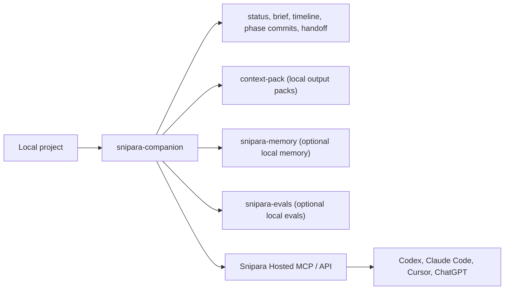

# snipara-companion

**Local helper CLI for Snipara agent workflows.**

`snipara-companion` adds Git-style continuity commands for agent work: status,
briefs, timelines, phase commits, handoffs, resume, diagnostics, hooks, folder
onboarding, local Mini Snipara bridges, and command-line access around Snipara
Hosted MCP. It complements the hosted context and memory surface; it is not the
primary runtime for agents.

`create-snipara` remains the canonical activation engine. Editor plugins and
extensions should expose the right entry point, but not fork local source scan,
First Work Brief, memory-candidate, or Hosted MCP config semantics. After the
first workspace brief, use companion for the repeatable local loop:

```bash
npx -y create-snipara@latest init --client cursor --starter
snipara-companion session-bootstrap --include-session-context --max-context-tokens 1000
snipara-companion source sync --json
snipara-companion code impact --changed-files src/app.ts --diff-summary "next edit"
snipara-companion task-commit --summary "completed durable change" --files src/app.ts
```

## Companion Continuity Contract V1

For editor integrations and "continue this workspace" flows, use the stable JSON
contract instead of rebuilding Companion internals:

```bash
snipara-companion continue-workspace --include-session-context --json
```

The response version is `snipara.companion.continuity.v1`. It includes:

- `project`: configured project id, API URL, and session id when available.
- `bootstrap` and `bootstrapQuality`: pushed session memories plus token,
  freshness, and warning metadata.
- `workflow`: active workflow id, goal, current phase, phase statuses, and local
  state path.
- `teamSync`: active/stale/completed counts and latest handoff summary.
- `source`: passive `.snipara/source/latest.json` status; no source sync is
  performed by this command.
- `sessionSnapshot`: latest local activity summary, risks, touched files, and
  recommended next action.
- `artifacts` and `nextActions`: stable local paths and commands an editor can
  surface to the user.

This contract starts after `create-snipara` has activated the workspace. Editor
extensions should orchestrate these commands and render the payload, not fork
local source scanning, First Work Brief, memory candidate, or Hosted MCP config
logic.

In this repository, the source currently lives in `packages/cli`, and the installed executable is `snipara-companion`.

This package complements `snipara-mcp`. It does not replace it.

## Quickstart

```bash
# 1. Install
npm install -g snipara-companion

# 2. Point this workspace at a Snipara project (writes local .snipara/ config)
snipara-companion init            # interactive; or: snipara-companion login

# 3. Use it in your agent workflow
snipara-companion brief           # what changed, why, impact, next action, safe-to-proceed
snipara-companion status          # current work across workflow, git, and Team Sync
snipara-companion handoff --summary "<what changed>" --next "<next step>"
```

Local continuity commands work without a Snipara account; commands that read
hosted context or memory need `init`/`login` first. Run
`snipara-companion --help` for the full command list.

## Local Context Pack

`context-pack` is a free, local-only reversible pack for long tool outputs,
logs, diffs, and notes. It stores exact content under
`.snipara/context-pack` and never uploads raw output to hosted Snipara.

```bash
# Pack piped tool output
pnpm test 2>&1 | snipara-companion context-pack pack \
  --label "package test output" \
  --source "pnpm test"

# Pack a local file
snipara-companion context-pack pack --file ./debug.log --kind log --json

# Retrieve exact content later
snipara-companion context-pack retrieve latest
snipara-companion context-pack retrieve cpack_abcd1234 --output ./restored.log
snipara-companion context-pack retrieve cpack_abcd1234 --json --metadata-only

# Inspect and clean local storage
snipara-companion context-pack stats
snipara-companion context-pack clean --older-than-days 14

# Attach metadata-only receipts to events/checkpoints
snipara-companion post-tool --tool Bash --result "$(cat ./debug.log)" --pack-result
snipara-companion emit-event -e tool_result --context-pack cpack_abcd1234
snipara-companion workflow runtime-checkpoint verify \
  --summary "Captured verifier output" \
  --context-pack cpack_abcd1234
```

The pack ID is derived from the content hash, so packing identical content is
idempotent. Use `--ttl-days` when temporary output should be cleaned by the
default `context-pack clean` path. The storage directory writes its own
`.gitignore` so raw pack blobs do not appear in normal Git staging. Pack blobs
are plaintext local files with restrictive permissions. Secret-like input is
blocked by default; use `--allow-sensitive` only when you intentionally need an
exact local recovery artifact, and prefer the exact pack ID over `latest` in
handoffs.

Metadata-only context-pack receipts include token economy fields:
`baseline_tokens`, `packed_tokens`, `retrieved_tokens`, and `saved_tokens`.
Pack/reference receipts can claim saved tokens because only receipt metadata is
uploaded; retrieve receipts set retrieved tokens to the local baseline so they
do not overstate savings.



## Mini Snipara Open Stack

`snipara-companion` is the local workflow layer in the open Mini Snipara stack:

| Repo                                                                | Role                                                                                                            | Account required                         |
| ------------------------------------------------------------------- | --------------------------------------------------------------------------------------------------------------- | ---------------------------------------- |
| [`snipara-companion`](https://github.com/Snipara/snipara-companion) | Local workflow continuity, hooks, handoffs, and hosted bridges                                                  | No for local state; yes for hosted calls |
| [`snipara-memory`](https://github.com/Snipara/snipara-memory)       | Local durable project memory engine and MCP/API wrapper                                                         | No                                       |
| [`snipara-evals`](https://github.com/Snipara/snipara-evals)         | Deterministic Project Intelligence evals for handoffs, context, decisions, impact, verification, and continuity | No                                       |

Hosted Snipara remains the managed layer for source authority, reviewed memory,
team-wide presence, shared claims/locks, conflict alarms, GitHub checks,
dashboard live views, and Cloud code graph impact. Local commands are useful for
single-machine continuity and CI artifacts, but they cannot prove what another
human or agent is doing on a different machine unless the hosted collaboration
backend is configured.

## Local vs Hosted Capabilities

| Capability                                   | Local/open stack                   | Hosted Snipara                              |
| -------------------------------------------- | ---------------------------------- | ------------------------------------------- |
| Workflow state, timeline, handoff files      | Yes                                | Syncs and enriches when configured          |
| Local project memory                         | Via `snipara-memory`               | Managed, reviewed, scoped memory            |
| Project Intelligence eval artifacts          | Via `snipara-evals`                | Can use hosted context/code graph as inputs |
| Git hooks and local guards                   | Yes                                | Stronger with hosted guard decisions        |
| Presence across machines and agents          | No                                 | Yes                                         |
| Shared claims/locks and stale lease handling | Local only is advisory             | Yes                                         |
| GitHub checks and dashboard live views       | No                                 | Yes                                         |
| Code graph impact and symbol cards           | Local overlay only where available | Cloud code graph                            |

## Agent Context AC-1 Evidence

Agent Context first compiles organization, project, and role-specific sources
and memory policy from `snipara.agent-context.json`:

```bash
snipara-companion agent-context validate
snipara-companion agent-context resolve \
  --agent snipara-code \
  --task "implement a bounded product change"
```

The AC-1 evidence workflow turns a completed representative task into a bounded,
tamper-evident local receipt:

```bash
snipara-companion agent-context evidence collect \
  --agent snipara-code \
  --output .snipara/agent-context/task-code-1.json

# The collect command only imports proof references from completed local workflow
# phases. Review observations before recording; it never claims source or memory use.
snipara-companion agent-context evidence template \
  --agent snipara-code \
  --task "implement a bounded product change" \
  --output .snipara/agent-context/task-code-1.json

# Edit the template with actual source use, recall keys, token count, findings,
# capability assessment, and outcome proof before recording it.
snipara-companion agent-context evidence record \
  --from .snipara/agent-context/task-code-1.json

snipara-companion agent-context evidence status --json
snipara-companion agent-context evidence status --enforce
```

The default ledger is `.snipara/agent-context/evidence.jsonl`. Recording fails
closed for duplicate task ids, modified receipt hashes, sources or recalls that
were not in the resolved plan, and promotion targets outside the reviewed
policy. Secret-like fragments and local home paths are redacted before append.

`status --enforce` exits non-zero until at least 20 representative tasks cover
every configured role, no high-severity leak remains unresolved, every observed
leak points to a regression test, repeated benefits are documented, and every
task includes an explicit missing-capability assessment. A repeated
cross-machine or multi-runtime signal is reported only as AC-2 evidence; it does
not replace the separate external design-partner gate. The CLI gate evaluates
only receipts linked to the current manifest hash and reports older receipts as
excluded, so a manifest change cannot inherit a false-ready result from an
earlier policy revision.

## When To Use It

| If you need...                                            | Install...               |
| --------------------------------------------------------- | ------------------------ |
| MCP tools, OAuth login, project-scoped context and memory | `snipara-mcp`            |
| One-command Hosted MCP + companion setup                  | `create-snipara`         |
| Git-style local continuity, workflow modes, and hooks     | `snipara-companion`      |
| Production gates, drift checks, and htask orchestration   | `snipara-orchestrator`   |
| OpenClaw-specific automation hooks                        | `snipara-openclaw-hooks` |

### Codex Note

For Codex, the primary integration remains Hosted MCP plus `AGENTS.md`.

- `create-snipara` installs `snipara-companion` by default for managed workflow commands.
- `snipara-companion` is still skippable with `--profile hosted-only` or `--skip-companion`.
- Use it when compaction-safe phase commits, Project Intelligence briefs, local doctor checks, or shared helper workflows are useful.
- Use `workflow scaffold --preset project-intelligence-continuity-layer` for roadmap-sized Project Intelligence work that needs phase commits.
- Normal agent sessions intentionally expose a small Snipara tool set. Use `snipara_help(query=...)` for routed guidance and `snipara_help(list_all=true)` to inspect specialist tools before requesting an expanded surface.

## Configuring MCP Tool Surfaces

The MCP server advertises different tool surfaces depending on the `SNIPARA_EXPOSED_SURFACES` environment variable. Hosted MCP defaults to the lean agent contract: context, search, read, stats, help, memory recall/capture, and end-of-task commit. Specialist inline, companion, and orchestrator tools stay discoverable via `snipara_help`, which now marks them as `routed_or_opt_in`; standard agents should usually stay on the simple verbs and let Snipara route internally. To expose companion tools directly in the advertised manifest, set `SNIPARA_EXPOSED_SURFACES=inline,companion` on the MCP server. To expose swarm and htask coordination tools, use `SNIPARA_EXPOSED_SURFACES=inline,orchestrator`. Standard MCP agents only receive schemas for tools returned by `tools/list`.

## Installation

```bash
npm install -g snipara-companion
# or
pnpm add -g snipara-companion
# or
yarn global add snipara-companion
```

## Installed Command

```bash
snipara-companion
```

## Changelog

Release notes have moved to [CHANGELOG.md](../CHANGELOG.md).

## Agentic Work Commands

`create-snipara` gets the project connected. `snipara-companion` keeps long
agent sessions resumable. Install once with `npx create-snipara`; continue every
session with `snipara-companion`:

```bash
snipara-companion status
snipara-companion source init .
snipara-companion source sync --json
snipara-companion brief --task "ship auth hardening" --changed-files src/auth.ts
snipara-companion reality-check --task "ship auth hardening" --changed-files src/auth.ts --enforce
snipara-companion timeline
snipara-companion workflow timeline
snipara-companion workflow timeline --export md
snipara-companion workflow session --json
snipara-companion workflow phase-commit build --summary "tests green"
snipara-companion workflow impact-gate
snipara-companion workflow producer-triage
snipara-companion workflow decisions
snipara-companion workflow policy-ledger
snipara-companion workflow decide decision-abc123 --choose accept_all --reviewer alice
snipara-companion workflow apply-decisions --dry-run
snipara-companion workflow sync-policy-ledger
snipara-companion workflow producer-report
snipara-companion workflow producer-review --latest --outcome useful --reviewer alice
snipara-companion workflow run --adaptive-routing-dry-run --route-local-workers "document a scoped change"
snipara-companion context-control plan --summary "record reviewed context state" --output .snipara/context-control/plans/demo.json
snipara-companion context-control apply --plan .snipara/context-control/plans/demo.json --approve
snipara-companion context-control drift
snipara-companion context-control validate --manifest snipara.project-context.json
snipara-companion lead-plan --task "ship auth hardening" --changed-files src/auth.ts --proof "pnpm test auth" --acceptance "auth tests pass"
snipara-companion verify --changed-files src/auth.ts --diff-summary "auth hardening"
snipara-companion agent-readiness audit --target codex --task "ship auth hardening" --changed-files src/auth.ts --proof "pnpm test auth" --acceptance "auth tests pass"
snipara-companion run --task "ship auth hardening" --changed-files src/auth.ts --release
snipara-companion handoff --summary "status command shipped" --next "publish package"
snipara-companion workflow resume --include-session-context
```

- `status` is the Git-style local work status: workflow phase, latest phase
  commit, git dirtiness, Team Sync handoffs, local risks, and next action.
- `source init` is the local source activation path for free/no-provider users:
  it writes a source snapshot, previews supported document sync, and refreshes
  the local code overlay cache without requiring GitHub.
- `brief` is the short alias for `intelligence brief`.
- `reality-check` compares changed files, linked intent, context docs, symbols,
  and verification hints to flag contradiction-to-reality risks before commit or
  merge. Output includes an Intent Ledger section with source-backed intent
  coverage, confidence, affected anchors, and missing intent anchors, plus an
  Unknown Registry section that ranks missing intent, missing verification,
  dirty local evidence, architecture drift, stale/review-pending intent, and
  heuristic-calibration gaps. Keep `--enforce` opt-in for narrow hooks or
  calibrated CI adapters; the heuristics are advisory and can produce false
  positives on broad text/path matches. Intent Ledger extraction prefers
  structured contract fields or explicit labeled sections such as `Goal:`,
  `Constraints:`, `Anti-goals:`, `Rejected alternatives:`, `Owner:`, and
  `Freshness horizon days:`. Generic prose remains a legacy fallback for goal
  text only; anti-goals and rejected alternatives are not inferred from loose
  words in free text.
- `timeline` is the Git-style log for workflow starts, phase starts, phase
  commits, final commits, and Team Sync handoffs.
- `workflow timeline` reads the append-only local activity log at
  `.snipara/activity/timeline.jsonl`, enriched by workflow, PostToolUse,
  Producer Loop, Decision Request, Team Sync, and journal-adjacent events. Add `--export md`
  for a compact redacted Markdown artifact suitable for handoff or publication.
- `workflow session` writes `.snipara/activity/session.json`, a fast Session
  Snapshot V0 for local resume and Orchestrator dogfood. It includes latest
  activity, risk reasons, touched files, next action, and advisory Intent
  Detection V0. Intent Detection V0 reports intent, confidence, evidence
  counts, reason-code signals, and an advisory suggested workflow mode. It is
  observational only and reports `hardRoutingAllowed=false` until explicit
  policy and receipts allow harder routing.
- `workflow impact-gate` audits committed local workflow phases that are ahead
  of upstream but not pushed. It does not push, and dirty working-tree files are
  reported separately from the committed diff. It also reports a readability
  budget for the committed diff: fewer than 200 changed lines is the target,
  200–400 asks for review, and more than 400 recommends splitting the change.
- `workflow producer-triage` scans unreviewed Producer Loop artifacts and emits
  a batched Decision Request artifact under `.snipara/decisions/pending/`.
  It never marks samples reviewed by itself.
- `workflow decisions` lists pending decision requests in a compact shape an LLM
  client can render as a human question, including evidence, options,
  recommendation, declared apply path, and readable evidence items for batched
  decisions.
- `workflow policy-ledger` summarizes local Project Policy decision artifacts
  for agent-mediated governance. It reports pending, approved, refused,
  modified, deferred, and expired policy decisions, includes agent prompts for
  pending human choices, and never applies or edits policy automatically.
- `workflow apply-decisions --dry-run` previews local follow-up actions for
  resolved Project Policy receipts. Running `workflow apply-decisions` writes
  only idempotent review artifacts such as local policy drafts under
  `.snipara/policies/drafts/`; it does not activate canonical Project Policy
  silently.
- `workflow sync-policy-ledger` uploads local Decision Request, resolution,
  apply receipt, and policy draft artifacts into the hosted Project Policy
  ledger for audit visibility. It remains observational and never approves,
  refuses, activates, or edits canonical Project Policy automatically.
- `workflow decide <request-id> --choose <option> --reviewer <name>` writes a
  Decision Response receipt under `.snipara/decisions/resolved/`. For
  Producer Loop triage accept/reject choices, it applies the existing
  `workflow producer-review` path and records the applied actions. Other
  producers remain advisory receipts with their existing hosted/manual apply
  path declared. Repeated resolved receipts with the same human choice and
  rationale can emit a review-only policy suggestion decision request; the
  suggestion still has a manual apply path and is never auto-applied.
- `run --emit-policy-decisions` keeps Project Policy administration agent-first:
  when reviewed project policy evidence produces a `require_review` or `block`
  verdict, Companion writes a local `project_policy_review` Decision Request.
  The human resolves it with `workflow decide`; choices such as approving once,
  requiring changes, respecting a block, requesting an exception, or marking
  policy stale are recorded as receipts. No policy is edited or invalidated
  automatically.
- `memory reviews --scope project --emit-decisions` reads hosted memory review
  queue, clean-candidate, and duplicate-candidate surfaces, summarizes each item,
  and writes local Decision Request artifacts without mutating hosted memory.
  JSON output includes `emittedCount`, `emittedRequestIds`, and an `emitted`
  summary for direct agent follow-up.
- `workflow producer-report` scans local Producer Loop artifacts emitted by
  workflow phase/final commits or exported PR Answer Pack decision-capture
  producers, then reports adoption, producer kinds, workflow ids, reason-code
  counts, invalid artifacts, sample size, reviewed/rejected/unreviewed counts,
  and calibration caveats with `hardGateReady=false`. It also scans attributed
  gated receipts and persisted reviews under `.snipara/orchestrator/`, reports
  receipt-family completeness, and groups supervised evidence by
  `(workerId, workCategory)` in `workerTrust`. It never promotes a worker or
  changes an execution gate.
- `workflow producer-review` marks one local Producer Loop artifact as
  `sample_reviewed` or `sample_rejected` after operator review. Use
  `--artifact <path|file|artifactId>` for an exact sample or `--latest` for the
  newest valid local artifact.
- `workflow run --adaptive-routing-dry-run` prints an Adaptive Work Routing
  card. Add `--route-local-workers` when a strong planner should keep deep
  reasoning while a local worker handles scoped execution.
- `context-control plan` writes a content-hashed local Context Mutation Plan V0
  for a bounded operation. The plan records the Git base and remains a preview
  until `context-control apply` writes the exact planned state.
- `context-control apply --plan <file> --approve` verifies the plan hash, records
  explicit review, rejects stale Git bases by default, writes only under
  `.snipara/context-control/`, and emits
  an apply receipt linked to the plan hash.
- `context-control drift` is a read-only Project Drift V0 report. It checks Git
  upstream state, scoped Git dirty files, managed workflow state, pending
  Decision Requests, saved plans and receipts, and ProjectContext manifest
  health. Dirty Git files only become drift when they touch the ProjectContext
  manifest, manifest sources, local Decision Requests, or
  `.snipara/context-control/`; unrelated checkout noise remains visible without
  classifying the project as `DRIFT_DETECTED`. `UNKNOWN` is never treated as
  `IN_SYNC`.
- `context-control validate --manifest snipara.project-context.json` validates
  Context as Code V0. The manifest is JSON metadata declaring context sources,
  tiers, authority, freshness, and review policies. Validation itself does not
  upload content or mutate hosted state.
- Context Control V1 uses `context-control hosted-diff` to produce a
  tenant-scoped immutable plan and optional Decision Request, then
  `context-control hosted-apply` to apply the resolved plan. The server rechecks
  remote hashes atomically, allows only create/update, never deletes unmanaged
  remote paths, blocks managed authority promotions, requires EDITOR API-key
  access, and returns a per-source receipt plus reindex status.

```text
$ snipara-companion context-control hosted-diff --manifest snipara.project-context.json --output .snipara/context-control/plans/hosted.json --emit-decision-request
$ snipara-companion workflow decide <request-id> --choose approve_hosted_apply --reviewer <name>
$ snipara-companion context-control hosted-apply --plan .snipara/context-control/plans/hosted.json --approval .snipara/decisions/resolved/<request-id>.json
```

- `lead-plan` turns local workflow state, Team Sync, file scope, context refs,
  proof gates, and acceptance criteria into an advisory Engineering Lead Plan.
  It emits worker recommendations and handoff contracts, keeps
  `workersSpawned: 0`, and does not launch agents.
- `verify` builds a transparent verification plan from companion code impact
  signals plus local package scripts. It recommends checks; it does not claim to
  execute them.
- `agent-readiness audit` creates a local delegation-readiness report with proof
  gaps and a service-pack recommendation. It reads explicit inputs plus local
  workflow/Team Sync state; it does not validate hosted auth or launch agents.
- `handoff` writes an agent-ready handoff artifact while persisting the same
  local/hosted Team Sync continuity record as `team-sync handoff`. Add
  `--adapter-pack --target <target>` to attach a portable ADE Adapter Pack.

The mental model is intentionally close to Git:

| Git habit             | Companion command                            |
| --------------------- | -------------------------------------------- |
| `git status`          | `snipara-companion status`                   |
| `git show`            | `snipara-companion brief`                    |
| `git commit`          | `snipara-companion workflow phase-commit`    |
| `git diff @{u}..HEAD` | `snipara-companion workflow impact-gate`     |
| review local samples  | `snipara-companion workflow producer-review` |
| `git log`             | `snipara-companion timeline`                 |
| `git format-patch`    | `snipara-companion handoff`                  |
| `git checkout`        | `snipara-companion workflow resume`          |

`snipara-companion final-commit` closes the local workflow and emits a stable
seven-section closeout report: what changed, why, evidence, decisions kept,
decisions proposed for review, items not persisted, and risks plus the next
step. Supply `--why`, repeatable `--evidence <status:text>`, repeatable `--risk`,
and `--next-step` to make the receipt explicit. Evidence statuses are `passed`,
`failed`, `not-run`, and `unknown`; unprefixed evidence is intentionally
`unknown`. The versioned and redacted JSON artifact is written to
`.snipara/workflow/final-report.json`; JSON command output includes the complete
report plus its path and SHA-256 hash.

The command asks the hosted API only for the final Team Sync handoff. It sends a
compact summary with a longer timeout, retries once with a shorter summary on
transient hosted failures, and then records a local fallback handoff in
`.snipara/team-sync/session.json` if the hosted call still times out. A hosted
final-commit timeout does not modify Git state. Custom final-commit categories
are namespaced under `final-commit` before the hosted call so they stay on the
handoff-only path. Stored phase commit receipts are reported separately from
pending Why Capture candidates, duplicates, failures, and final handoff-only
content; generating the report never approves pending memory. Completed
workflow commits also reconcile local Team Sync work: exact goal/summary matches
close directly, and slug-like workflow goals can still close the matching
active work when touched files overlap and meaningful workflow tokens match.

## Adaptive Work Routing

Adaptive Work Routing is a recommendation-first path for routing scoped work to
the right worker class, endpoint type, and cost profile without hardcoding model
names in the CLI.

```bash
snipara-companion workflow run \
  --mode full \
  --adaptive-routing-dry-run \
  --route-local-workers \
  --routing-worker-role coding \
  --routing-preferred-endpoint local \
  --routing-allowed-endpoint local \
  --routing-allowed-endpoint cloud \
  --planner-retains-reasoning \
  --strong-repair \
  "Update documentation for the new gateway"
```

The output is a routing card and handoff metadata. Companion calls the hosted
`snipara_adaptive_routing_catalog` tool when project auth and policy allow it,
records the sanitized runtime catalog in the handoff, and falls back to local
dry-run metadata when the hosted gateway is unavailable or omits
`success: true`. It does not silently spawn workers. The stable contract is
provider-neutral requirements such as worker role, reasoning depth, context
budget, endpoint type, write scope, and fallback.

Project owners can configure Adaptive Work Routing in Project > Automation:
`off`, `recommend`, or `catalog`; approval; planner-retained reasoning; allowed
endpoint types (`cloud`, `local`, `self_hosted`); worker classes; and budget
hints. `workflow run` reads that hosted policy and CLI flags cannot broaden it.
Companion passes policy budgets into provider-neutral model requirements; the
hosted gateway enforces project and provider daily/monthly budgets when receipt
history is available.

Approval is an MCP contract, not a dashboard-only UX path. When project policy
requires approval, a coding agent calls `snipara_adaptive_routing_approve` with
the routing card or handoff subject, approved write scopes, endpoint types, a
stable `idempotency_key`, and optional cost/expiry bounds. Companion dry-runs
surface the approval requirement but do not auto-approve or spawn workers.
Project credentials stay server-side behind the hosted gateway; local endpoints
such as Ollama, LM Studio, AnythingLLM, or other OpenAI-compatible servers must
be reachable from the worker execution environment.

For a local worker, use Companion to emit the handoff, then let
`snipara-orchestrator` resolve that handoff against an explicit local runtime
catalog. In the Codex workflow, Codex remains the chief architect, lead
orchestrator, and quality verifier; local workers (including LM Studio, Ollama,
OpenAI-compatible endpoints, and declared CLI workers) are bounded candidates
whose outputs still need Codex review and proof gates.

Declare a reusable local LM Studio GPT-OSS-20B coding worker once:

```bash
snipara-companion workers local add \
  --id local-gpt-oss-20b-coding \
  --role coding \
  --provider lm-studio \
  --base-url http://127.0.0.1:1234 \
  --model openai/gpt-oss-20b \
  --api-key-env LM_STUDIO_API_KEY
```

The declaration is written under `.snipara/workers/<worker-id>.json`; Companion
also updates `.snipara/adaptive-routing.json` so local endpoints are allowed
and preferred for this project. Use the worker in a workflow run with:

```bash
snipara-companion workflow run \
  --mode standard \
  --adaptive-routing-dry-run \
  --routing-local-worker local-gpt-oss-20b-coding \
  --emit-orchestrator-handoff \
  "Implement a scoped coding change"
```

Use `workers local list` to inspect all declared workers and `workers local remove`
to delete one:

```bash
snipara-companion workers local list
snipara-companion workers local remove local-gpt-oss-20b-coding
```

The worker registry is versioned project state. When `.snipara/workers/` is
tracked, every worktree that rebases or pulls from `main` receives the same
declared workers, including the default `local-openai-gpt-oss-20b` profile used
by this repository. `workers local add` and `workers local remove` therefore
show up in `git status` and should be reviewed like any other team-visible
configuration change.

Do not store secrets in worker profiles. Local endpoints such as
`http://127.0.0.1:1234` are safe to commit when they contain no credentials, but
cloud CLI transports or authenticated endpoints must reference secrets through
environment variables rather than embedding API keys, bearer tokens, passwords,
or private URLs directly in `.snipara/workers/*.json`. `--api-key-env` stores
only the variable name; pair it with `--api-key-header authorization` (default)
or `--api-key-header x-api-key`. Native Codex and Claude profiles use their
host-managed credentials. A generic `cli://command` profile fails closed unless
the command maps to a supported Codex or Claude adapter.

Use `workers local probe` to query a local endpoint and preview a declaration
proposal before committing it:

```bash
snipara-companion workers local probe \
  --base-url http://127.0.0.1:1234 \
  --role coding \
  --model openai/gpt-oss-20b \
  --json
```

`--routing-local-worker` loads the local declaration, pins the configured model,
and disables hosted catalog lookup for that run. The result is still a bounded
routing/handoff contract: Companion resolves the local candidate through
`snipara-orchestrator`, records metadata, and leaves execution plus proof review
to the supervising agent workflow.

Add `--strong-repair` when the supervising workflow should permit one strong
adapter repair after a local proof or output failure. The handoff records the
contract (`maxAttempts: 1`, same scope and proof, strong adapter as final
authority, `main_agent` fallback); Companion remains recommendation-only and
does not launch the worker.

Use Qwen for reflection, architecture, and documentation:

```bash
snipara-companion workflow run \
  --mode full \
  --adaptive-routing-dry-run \
  --route-local-workers \
  --routing-worker-role documentation \
  --routing-preferred-endpoint local \
  --routing-allowed-endpoint local \
  --planner-retains-reasoning \
  "Update a scoped docs surface"

snipara-orchestrator local-model-catalog \
  --base-url http://127.0.0.1:1234 \
  --model qwen/qwen3-30b-a3b-2507 \
  --worker-role documentation \
  --capability documentation \
  --capability architecture_review \
  --capability planning \
  --json > .snipara/local-qwen-docs-runtime-catalog.json

snipara-orchestrator route --dry-run \
  --work-profile-json '{"taskType":"documentation","risk":"low","scope":["docs/**"],"contextBudget":"small","reasoningDepth":"low"}' \
  --requirements-json '{"workerRole":"documentation","plannerRetainsReasoning":true,"preferredEndpointTypes":["local"],"allowedEndpointTypes":["local"],"writeScope":["docs/**"],"capabilities":["documentation"]}' \
  --catalog-file .snipara/local-qwen-docs-runtime-catalog.json \
  --json
```

Use Devstral for development and refactoring work:

```bash
snipara-orchestrator local-model-catalog \
  --base-url http://127.0.0.1:1234 \
  --prefer-model devstral \
  --worker-role coding \
  --capability code_edit \
  --capability refactor \
  --json > .snipara/local-devstral-runtime-catalog.json
```

For a remote OpenAI-compatible runtime, use an explicit allowlist and an
environment-backed key when running the native host:

```bash
snipara-orchestrator host run \
  --adapter openai_compatible \
  --base-url https://provider.example.com --allow-remote \
  --api-key-env PROVIDER_API_KEY --api-key-header authorization \
  --model provider/coder --task "Bounded task" --workspace . \
  --write-scope docs/** --proof "git diff --check" --execute
```

For a loopback local worker with one explicit strong repair attempt:

```bash
snipara-orchestrator host run \
  --adapter openai_compatible --base-url http://127.0.0.1:1234 \
  --model local/coder --task "Bounded task" --workspace . \
  --write-scope docs/** --proof "git diff --check" \
  --strong-repair --repair-adapter codex_app_server --execute
```

The repair reuses the approval envelope when approval is required, reruns the
same proof, and records redacted repair metrics in the durable host receipt.
Scope violations, unavailable repair hosts, skipped proof, or a failed repair
escalate without a retry loop.

Native host proof commands run automatically after dispatch. Use
`--no-run-proof` only when a reviewer will validate the receipt; the state then
remains `verification_required`. Use `--require-approval` with both an approval
receipt id and `--approval-receipt-file <json>` for unattended execution; an id
alone never bypasses the approval gate.

The local catalog records the OpenAI-compatible routes exposed by LM Studio:
`GET /v1/models`, `POST /v1/responses`, `POST /v1/chat/completions`,
`POST /v1/completions`, and `POST /v1/embeddings`. `--prefer-model devstral`
selects the first `/v1/models` id containing `devstral`; use `--model <id>` to
pin Qwen or any other exact local model id. This makes Qwen, Devstral, or
another local model routable through the Companion/Orchestrator contract while
keeping execution fail-closed: the selected candidate is a receipt-backed worker
target, not an automatically launched process.

For the open package without Snipara SaaS, add a local policy file:

```json
{
  "mode": "recommend",
  "plannerRetainsReasoning": true,
  "preferLocalWorkers": true,
  "allowedEndpointTypes": ["local", "cloud"],
  "preferredEndpointTypes": ["local"],
  "allowedWorkerClasses": ["documentation", "tests", "review"],
  "catalogLimit": 8
}
```

Save it at `.snipara/adaptive-routing.json`. Without hosted configuration,
`workflow run` only emits local Adaptive Work Routing metadata and handoff files:
it does not query hosted context, call the hosted catalog, or spawn workers.

## Engineering Lead Plans

Use `lead-plan` when Companion should act as an engineering lead before any
worker handoff:

```bash
snipara-companion lead-plan \
  --target codex \
  --task "ship auth hardening" \
  --changed-files src/auth.ts tests/auth.test.ts \
  --context AGENTS.md docs/features/ADAPTIVE_WORK_ROUTING.md \
  --proof "pnpm test auth" \
  --acceptance "auth tests pass" \
  --json
```

The command reads local workflow state, Team Sync, project instructions, and
explicit inputs. The output uses the same lead-plan vocabulary as Project
Health: posture, score, routing mode, bounded worker contract, supervised work
packages, supervision/replan status, proof gates, candidate Project Brain
updates, `workersSpawned: 0`, and `main_agent` fallback.

Engineering Lead execution receipts add `executionReceipts` to that plan.
Each receipt records the expected handoff, claim, approval, proof, outcome, and
Project Brain update stages for a work package, plus missing requirements and
next actions. Unknown future receipt enum values fail closed with
`companion_dropped_unknown_execution_receipt_*` reason codes.
`proofExecuted` and completed proof stages are treated as self-attested signals
until a proof receipt or source-backed `proofVerification.status: "verified"`
with source evidence and a fresh `verifiedAt` timestamp is present.

Use `--from-cockpit <file>` or `--from-plan <file>` when Project Health has
exported a cockpit/lead-plan JSON artifact and Companion only needs to normalize
it into Markdown or JSON for handoff. Add `--reconcile` to compare the imported
plan against current local workflow, Team Sync, proof, acceptance, and file
scope signals. This is still advisory and fail-closed: the command does not
approve work, execute proof gates, or spawn workers.

## Verification Plans

Use `verify` when an agent asks what to prove before handoff or release:

```bash
snipara-companion verify --changed-files src/auth.ts tests/auth.test.ts --diff-summary "auth hardening"
snipara-companion verify --file-path src/auth.ts --json
snipara-companion verify --skip-impact --changed-files src/auth.ts
```

Output includes:

- recommended checks from code impact and local package scripts
- impacted files
- risk level and score when code impact is available
- missing checks and caveats
- suggested next commands

## Agent Readiness Audits

Use `agent-readiness audit` when a team wants to know whether a task can be
delegated safely to Codex, Claude Code, Cursor, Orca, Kimi Code CLI, or a custom
worker:

```bash
snipara-companion agent-readiness audit \
  --target codex \
  --task "ship auth hardening" \
  --changed-files src/auth.ts tests/auth.test.ts \
  --context AGENTS.md docs/features/PROJECT_INTELLIGENCE.md \
  --proof "pnpm test auth" \
  --acceptance "auth tests pass" \
  --json
```

The output includes:

- 100-point readiness score and band;
- pass/warning/fail checks for scope, context, workflow, Team Sync, proof,
  verification, and target adapter;
- blocker/high/medium/low gaps with next actions;
- recommended service pack: launch review, enablement pack, or hardening sprint;
- suggested companion commands for workflow, Team Sync, handoff, and verify.

This is a bounded audit/report primitive. It does not execute proof gates,
validate hosted MCP auth, create branches, or run agents.

## Why and Outcome Capture Preview

Use `outcome-capture preview` when a workflow, handoff, commit, test run, deploy
check, review, or explicit feedback should be converted into review-pending
candidate data before a human or hosted API decides what to persist:

```bash
snipara-companion outcome-capture preview \
  --event phase_commit \
  --summary "ADE adapter pack supports portable targets" \
  --outcome completed \
  --source-ref phase-4-ade-adapter-pack-v1 \
  --files packages/cli/src/commands/team-sync.ts \
  --evidence "pnpm --filter snipara-companion test" \
  --json
```

The command can also read `{ "events": [...] }` from `--from-file`. It emits a
`snipara.why_outcome_capture.v1` report with bounded decision/outcome
candidates, provenance, dedupe keys, redaction metadata, and
`reviewStatus: "review_pending"`. It does not approve memory, write Project
Brain truth, or treat test/deploy/review evidence as causal proof.
Add `--emit-decisions` to write one Decision Request artifact per
review-pending candidate. Those requests ask whether to promote/reject/keep the
candidate pending and declare the existing reviewed memory path; they do not
write durable memory directly.

Add `--emit-outcome-receipt` when the same event should also produce an Outcome
Intelligence V0 receipt:

```bash
snipara-companion outcome-capture preview \
  --event test_result \
  --summary "Companion tests passed" \
  --status passed \
  --source-ref test:companion \
  --files packages/cli/src/commands/run.ts \
  --evidence "pnpm --filter snipara-companion test" \
  --emit-outcome-receipt \
  --task-kind feature \
  --risk medium \
  --surface workflow \
  --json
```

The receipt schema is `snipara.outcome_intelligence.receipt.v0`. It carries a
task profile, reason codes, verification evidence counts, outcome status, and
caveats. It is local calibration evidence; it is not causal proof, canonical
Project Brain memory, a global agent trust score, or permission to bypass
Project Policy.

For a managed workflow, import only the completed phases from its local snapshot
and preserve an existing Companion session identity for Hosted MCP joins:

```bash
snipara-companion outcome-capture preview \
  --from-workflow .snipara/workflow/current.json \
  --session-id "$SNIPARA_SESSION_ID" \
  --emit-outcome-receipt \
  --json
```

The session identity is optional, bounded, and correlation-only; it is never
authentication or tenant authority. Workflow receipts remain audit/shadow
signals and do not influence ranking or Project Policy.

## ADE Adapter Pack Handoffs

Use `handoff --adapter-pack` when the receiving execution cockpit is Codex,
Claude Code, Cursor, Orca, Kimi Code CLI, or a custom worker:

```bash
snipara-companion handoff \
  --summary "auth hardening ready for implementation" \
  --next "run auth regression tests" \
  --files apps/web/src/lib/auth.ts \
  --attention proof \
  --adapter-pack \
  --target codex \
  --context AGENTS.md docs/features/PROJECT_INTELLIGENCE.md \
  --proof "pnpm test auth" \
  --acceptance "auth tests pass" \
  --conflict-posture review_only \
  --output .snipara/handoffs/auth-codex.json \
  --json
```

The adapter pack adds target profile/posture, `runtimeControl: handoff_only`,
context refs, file scope, conflict posture, proof gates, acceptance criteria,
receipt expectations, and a portable prompt. It is still a handoff contract:
companion does not control the target runtime, install native hooks, or run the
receiving agent.

## Supported Client Presets Today

The built-in `init` and `automations` flows share these client names:

- `claude-code`
- `cursor`
- `kimi`
- `codex`
- `gemini`
- `mistral`
- `chatgpt`
- `vscode`
- `continue`
- `custom`

Claude Code, Cursor, Kimi Code CLI, Codex, and Gemini have native or generated hook
surfaces. Mistral, ChatGPT, VS Code, Continue, and custom clients are MCP-first presets: companion
prints the hosted MCP config/reference and installs dashboard-generated
automation files only when the hosted project exposes a bundle for that client.

## Quick Start

### Claude Code

```bash
npx -y snipara-companion@latest init --with-hooks --client claude-code
```

### Cursor

```bash
npx -y snipara-companion@latest init --with-hooks --client cursor
```

### Kimi Code CLI

```bash
npx -y snipara-companion@latest init --with-hooks --client kimi
npx -y snipara-companion@latest automations install --client kimi
# In Kimi Code, after reviewing the generated files:
/plugins install .kimi-code/snipara-plugin
```

Kimi reads `.kimi-code/mcp.json` and resolves `SNIPARA_API_KEY` from the launch
environment. Its plugin hooks are fail-open, so keep manual approval for risky
tools and treat Hosted MCP tenant checks plus Companion guards as the hard
boundary. Kimi installs plugins per user; the generated handler no-ops outside
workspaces carrying a Snipara project or Companion marker.

### Codex

```bash
npx -y snipara-companion@latest init --client codex
```

### Gemini Or Other MCP Clients

```bash
npx -y snipara-companion@latest init --client gemini
npx -y snipara-companion@latest init --client mistral
npx -y snipara-companion@latest init --client vscode
npx -y snipara-companion@latest init --client continue
npx -y snipara-companion@latest init --client custom
```

### Dashboard-Generated Automations

Use `automations install` when you want the local project to match the hook
bundle generated by Project Automation in the dashboard:

```bash
npx -y snipara-companion@latest automations install --client claude-code
npx -y snipara-companion@latest automations install --client cursor
npx -y snipara-companion@latest automations install --client kimi
npx -y snipara-companion@latest automations install --client codex
npx -y snipara-companion@latest automations status
npx -y snipara-companion@latest automations diff
npx -y snipara-companion@latest automations update
```

The companion fetches the current project bundle from the hosted dashboard API,
writes the generated files, and tracks them in
`.snipara/automations/manifest.json`. Generated scripts read the API key from
`SNIPARA_API_KEY` or the existing companion config created by
`create-snipara`/`npx -y snipara-companion@latest init`; the install flow does not prompt for
or embed a second key. Managed files are not overwritten after local edits
unless you pass `--force`.

Agent instruction files are always merged, not replaced. Existing `AGENTS.md`,
`CLAUDE.md`, `GEMINI.md`, `.cursorrules`, and Copilot instructions keep their
local content while Snipara adds or refreshes a marked Snipara section. Known
client JSON configs for Claude, Cursor, Continue.dev, Kimi, Gemini, VS Code,
and root `mcp.json` are deep-merged so existing servers and hooks are preserved.
Mistral generates MCP-first files (`MISTRAL.md`, Vibe config, Le Chat connector
reference, and LangChain `ChatMistralAI.bindTools` snippets); Mistral request
hooks are model request hooks, not local agent lifecycle hooks.

All generated HTTP/SSE references include a bounded correlation header sourced
from `SNIPARA_SESSION_ID`. Set it to the session printed by `init` before
starting Codex, Claude, Cursor, VS Code/Continue, GLM, or another generic MCP
host. The hosted server uses the header only for project-scoped retrieval
telemetry and ignores invalid values. If the host cannot inject environment
headers, pass the same value as `correlation_context.session_id` on
`snipara_context_query`, `snipara_recall`, `snipara_search`, `snipara_ask`, and
`snipara_get_chunk`.

Companion's own Hosted MCP client always forwards the configured workspace
`sessionId` as `X-Snipara-Session-Id`. For the five correlated retrieval tools,
it also supplies `client: "snipara-companion"` when the caller did not provide a
client label. The session value is telemetry-only: it never authenticates the
request, changes project scope, or overrides explicit per-call correlation.

OpenClaw hooks remain separate:

```bash
npx snipara-openclaw-hooks install
```

## Commands

### `snipara-companion init`

Initialize local configuration and optionally generate client hook files.

```bash
npx -y snipara-companion@latest init
```

Options:

- `--api-key <key>` - Skip prompt for API key
- `--project <project>` - Skip prompt for project slug or ID
- `--project-id <id>` - Deprecated alias for `--project`
- `--client <client>` - `claude-code`, `cursor`, `kimi`, `codex`, `gemini`, `mistral`, `chatgpt`, `vscode`, `continue`, or `custom`
- `--with-hooks` - Install hooks automatically
- `--force` - Overwrite existing generated files
- `--dir <directory>` - Target directory for generated files

### `snipara-companion config`

Show the current configuration.

```bash
snipara-companion config
```

### `snipara-companion pre-tool`

Resolve a query from tool input, emit a canonical tool call, and print a Rescue Pack when hosted Stuck Guard asks for intervention.

```bash
snipara-companion pre-tool '{"path":"/src/api/auth.ts"}'
snipara-companion pre-tool '{"tool":"Bash","command":"pnpm db:push"}'
```

### `snipara-companion post-tool`

Track file access and emit a canonical tool result for the current session.

```bash
snipara-companion post-tool '{"file_path":"/src/api/auth.ts"}'
snipara-companion post-tool '{"tool":"Bash","command":"pnpm test","exit_code":1}'
```

When the hook verifies that a commit-like Git operation actually created the
current commit, and no managed workflow is in progress, it also submits the
commit message to Why Capture. The preview/confirmation flow carries the full
commit SHA and changed-file evidence as `sourceKind=commit`; only
rationale-shaped messages create candidates, which remain pending human review.
Managed workflow commits keep their existing phase/final capture path and are
not captured a second time by this hook.

### `snipara-companion stuck-guard`

Inspect or simulate hosted Memory Guard decisions.

```bash
snipara-companion stuck-guard status
snipara-companion stuck-guard check --tool Bash --command "pnpm db:push" --exit-code 1
snipara-companion stuck-guard simulate --fixture ./stuck-guard-fixture.json
```

Use `status` to inspect the current session window. Use `check` from local scripts when you have a single current tool result. Use `simulate` for repeatable fixtures before turning on `enforce` mode.

### `snipara-companion session-end`

Persist the current session.

```bash
snipara-companion session-end
```

### `snipara-companion session status`

Show current session information.

```bash
snipara-companion session status
```

### `snipara-companion session reset`

Start a new session ID locally.

```bash
snipara-companion session reset
```

### `snipara-companion emit-event`

Forward a canonical lifecycle event into Snipara's hosted automation API.

```bash
snipara-companion emit-event \
  --event-type tool_call \
  --payload '{"hook":"pre-tool","tool":"Read","query":"auth middleware"}'
```

### `snipara-companion automations`

Install and maintain dashboard-generated automation hook bundles locally.

```bash
npx -y snipara-companion@latest automations install --client claude-code
npx -y snipara-companion@latest automations install --client cursor --dir ./app
npx -y snipara-companion@latest automations install --client gemini --dir ./app
npx -y snipara-companion@latest automations diff
npx -y snipara-companion@latest automations update
npx -y snipara-companion@latest automations status
```

The install/update flow refuses to overwrite unmanaged files or managed
generated hook scripts that changed locally. Markdown instruction files and
known JSON configs are merged instead of replaced. Use `diff` first, then
`--force` only when replacing a managed script is intentional.

Use this when a thin local adapter needs to report lifecycle activity without owning
durable memory policy locally.

### Workflow Commands

These commands keep local workflow state moving and call hosted Snipara only
where the specific command needs hosted context or memory:

#### Canonical command forms

`workflow run --mode` accepts exactly these values:

| CLI value     | Guide label         | Runtime behavior                                                      |
| ------------- | ------------------- | --------------------------------------------------------------------- |
| `lite`        | LITE                | Small, known-scope work with no mandatory hosted context call         |
| `standard`    | STANDARD            | Normal work with context and code-graph follow-up when needed         |
| `auto`        | AUTO                | Routes by task intent to `lite`, `standard`, `full`, or `orchestrate` |
| `full`        | FULL                | Managed, phased work with durable context and plan support            |
| `orchestrate` | FULL + ORCHESTRATED | Explicit deeper orchestration for multi-agent or proof-gate work      |

The root `run` command is the Project Intelligence judgment/release flow.
`workflow run` is the workflow-mode runner; they are different commands.
Use root `final-commit` as the canonical final closeout. The registered
`workflow final-commit` spelling is a compatibility alias. Similarly,
`code impact` is the canonical impact gate, root `impact` is its compatibility
alias, and `code local impact` is the separate repository-local overlay query.
`task-commit` captures a durable task outcome; `workflow phase-commit`
records one managed phase and advances the workflow.

```bash
npx -y snipara-companion@latest workflow run --mode standard --query "who imports src.mcp_transport"
npx -y snipara-companion@latest workflow run --mode auto --query "map the next bounded change"
npx -y snipara-companion@latest workflow run --mode full --include-session-context --query "plan the auth refactor"
npx -y snipara-companion@latest plan --query "plan the auth refactor" --write-plan-file .snipara/workflow/plans/auth-refactor-plan.json
npx -y snipara-companion@latest task-commit --summary "Shipped auth refactor" --files apps/web/src/lib/auth.ts

snipara-companion query --query "auth middleware"
snipara-companion query --query "auth middleware" --search-mode keyword --no-answer-pack --timeout-ms 30000
snipara-companion query --query "who calls src.mcp_transport.handle_call_tool" --follow-recommendation
snipara-companion status
snipara-companion brief --task "ship auth hardening" --changed-files apps/web/src/lib/auth.ts tests/auth.test.ts --diff-summary "auth hardening"
snipara-companion reality-check --task "ship auth hardening" --changed-files apps/web/src/lib/auth.ts --verification "pnpm test auth" --enforce
snipara-companion handoff --summary "auth hardening implemented" --next "run permissions tests" --files apps/web/src/lib/auth.ts --output handoff.md
snipara-companion intelligence brief --task "ship auth hardening" --changed-files apps/web/src/lib/auth.ts tests/auth.test.ts --diff-summary "auth hardening"
snipara-companion workflow scaffold --preset project-intelligence-continuity-layer --output .snipara/workflow/plans/project-intelligence-plan.json
snipara-companion plan --query "ship auth hardening" --start-workflow --workflow-id auth-hardening
snipara-companion workflow start --goal "ship auth hardening" --plan-file ./plan.json
snipara-companion workflow status
snipara-companion workflow impact-gate
snipara-companion timeline
snipara-companion workflow phase-start context
snipara-companion workflow run --mode standard --query "who imports src.mcp_transport"
snipara-companion workflow run --mode full --include-session-context --query "load context for the auth refactor"
snipara-companion workflow phase-commit context --summary "Loaded context and mapped impacted files" --files src/auth.ts
snipara-companion workflow resume --include-session-context
snipara-companion workflow phase-start implementation
snipara-companion workflow run --mode full --include-session-context --query "implement the auth refactor"
snipara-companion workflow run --mode full --no-runtime-hint --query "implement the auth refactor"
snipara-companion workflow run --mode orchestrate --query "map production rollout risks"
snipara-companion workflow final-commit --summary "Shipped auth hardening and tests" --why "Close the reported session replay gap" --evidence "passed:pnpm test auth" --risk "Monitor production auth errors" --next-step "Review the first 24 hours of telemetry" --files src/auth.ts tests/auth.test.ts
snipara-companion workflow producer-report
snipara-companion workflow producer-review --artifact producer-abc123 --outcome useful --reviewer alice
snipara-companion final-commit --summary "Shipped auth hardening and tests" --why "Close the reported session replay gap" --evidence "passed:pnpm test auth" --next-step "Review the first 24 hours of telemetry" --files src/auth.ts tests/auth.test.ts
snipara-companion doctor
snipara-companion doctor --json
snipara-companion collaboration guard --profile pre-deploy --enforce
snipara-companion code callers --qualified-name src.mcp_transport.handle_call_tool
snipara-companion code imports --file-path src/mcp_transport.py
snipara-companion code neighbors --qualified-name src.mcp_transport.handle_call_tool --depth 3
snipara-companion code shortest-path --from src.server.mcp_endpoint --to src.mcp_transport.handle_call_tool
snipara-companion code symbol-card --qualified-name src.mcp_transport.handle_call_tool
snipara-companion code impact --changed-files apps/web/src/lib/auth.ts tests/auth.test.ts --diff-summary "auth hardening" --depth 4 --direction in
snipara-companion plan --query "implement OAuth device flow"
snipara-companion upload --path docs/spec.md --file ./docs/spec.md
snipara-companion upload --path clients/acme/current.md --file ./current.md --asset-class BUSINESS_DOCUMENT --usage-mode current_truth --source-kind local_agent --client-id acme
snipara-companion upload --path diagrams/network.vsdx --file ./diagrams/network.vsdx --kind BINARY --format vsdx --reindex
snipara-companion upload --path docs/spec.md --file ./docs/spec.md --reindex
snipara-companion references scan --allow-domain docs.stripe.com --allow-domain docs.github.com
snipara-companion references ingest --upload --reindex
snipara-companion business-collections list
snipara-companion business-collections ensure --preset business_response_playbook
snipara-companion business-collections ensure --preset offer_templates
snipara-companion business-collections upload --preset offer_templates --title "Standard Offer Structure" --file ./offer-template.md
snipara-companion client-projects list
snipara-companion client-projects create --name "ACME Network Refresh" --slug acme-network-refresh
snipara-companion onboard-folder ./client-export --source-provider chatgpt_drive --write-manifest ./snipara-onboard.json
snipara-companion onboard-folder ./client-export --source-provider claude_notion --apply
snipara-companion sync-documents --dir ./docs --recursive --prefix docs --reindex
snipara-companion sync-documents --file ./snipara-documents.json --delete-missing --reindex
snipara-companion sync-documents --file ./snipara-business-context.json --dry-run --json
snipara-companion reindex --kind doc --mode incremental
snipara-companion reindex --job-id index_job_123
snipara-companion business-health --json
snipara-companion memory audit --scope project --include-inactive
snipara-companion memory health --scope project --json
snipara-companion memory clean-candidates --scope project --limit-per-bucket 10
snipara-companion memory compact --scope project --json
snipara-companion memory invalidate mem_old --reason "obsolete runbook"
snipara-companion memory supersede mem_old mem_new --reason "corrected decision"
snipara-companion memory local -- version
snipara-companion eval export \
  --summary "Implemented auth hardening and ran tests" \
  --decision "Code graph remains hosted" \
  --verification "pnpm test" \
  --continuity "Leave a concise next-step handoff" \
  --files src/auth.ts tests/auth.test.ts \
  --command-run "pnpm test" \
  --output .snipara/evals/auth-hardening.json
snipara-companion eval run .snipara/evals/auth-hardening.json --strict
snipara-companion chunk get --chunk-id chunk_123
snipara-companion multi-query --queries "auth flow" "rate limiting"
snipara-companion orchestrate --query "understand the auth architecture"
snipara-companion load-document --path docs/auth.md
snipara-companion recall --query "What did we decide about auth retries?" --type decision
snipara-companion events recent --limit 20
snipara-companion session-bootstrap --max-critical-tokens 2000
snipara-companion session-bootstrap --include-session-context --max-context-tokens 1000
snipara-companion task-commit --summary "Shipped event ingestion and dashboard inspection" --files apps/web/src/components/automation/automation-settings-panel.tsx
```

The installed executable is `snipara-companion`. Prefer `npx -y snipara-companion@latest ...`
for one-off commands when you need to bypass a stale global binary; there is no separate `snipara-workflow` binary.
`snipara-companion` does not execute Snipara Sandbox jobs itself. Snipara Sandbox MCP `execute_python` can run
without an extra LLM provider key because your AI client supplies the reasoning; standalone
`snipara-sandbox run` and `snipara-sandbox agent` need an `OPENAI_API_KEY` or `ANTHROPIC_API_KEY`.
`workflow resume` restores local workflow state plus hosted memory/handoff continuity. For
runtime-bound phases it also restores the recorded Sandbox binding and prints a reattach or
rehydrate plan. It does not snapshot or exactly restore a live Snipara Sandbox or REPL process.
Short-lived session context is skipped unless you pass `--include-session-context`
or an explicit `--max-context-tokens`. Text output is a compact bootstrap brief
and is silent when no high-signal item is available; use `--json` for the full
payload.
The brief reserves bounded space for the newest project/client profile and then
the authenticated owner operating profile before ranking decisions and recent
carryover. Additional project/client profiles remain eligible critical context.
The owner profile is explicit and reviewable; Companion does not infer it from
conversation history.
`workflow run --mode full --json` also reports `workflow_budget`,
`session_bootstrap_quality`, and `plan_quality.warnings` so agents can detect
oversized bootstrap context or weak generated-plan file hints before editing.
`doctor` reports the running companion version and warns when the workspace
`packages/cli` package or npm latest is newer than the installed binary.
For diagnostics and Snipara Sandbox hints, companion also detects these keys in local `.env`, `.env.local`,
`.env.development`, and `.env.development.local` files without printing their values.

By default these commands print human-readable terminal output. Add `--json` when you want the raw
hosted response.

### Team Sync Continuity

`snipara-companion team-sync` always keeps the local continuity file at
`.snipara/team-sync/session.json`. When the workspace is configured with a
project API key, the same commands also call the hosted Team Sync surfaces:

- `team-sync start-work` records local intent, reports whether the hosted Start Work Brief loaded, and fetches the brief when project auth is configured.
- `team-sync handoff` records the local handoff and publishes the hosted handoff capsule.
- `team-sync what-changed` keeps local counters but also loads the hosted What Changed For Me surface.
- `team-sync resume` and `workflow resume` append the latest hosted handoff plus checkpoint-aware resume context when available.
- `team-sync sweep` archives local work items after 14 days without update by default; use `--dry-run` to review candidates, actual archive count, and remaining stale work before changing the local continuity file.
- Hosted MCP also exposes `snipara_resume_context` for agents that want the same continuity bundle directly: latest handoff match, What Changed, active decisions, execution-memory, and an optional task-scoped work brief.

Typical flow:

```bash
snipara-companion team-sync start-work --summary "add invite permissions" --files apps/web/src/lib/auth/permissions.ts
snipara-companion team-sync handoff --summary "moved project access check" --next "run permissions tests before merge" --attention proof
snipara-companion team-sync what-changed
snipara-companion team-sync sweep --dry-run
snipara-companion workflow resume --include-session-context
snipara-companion workflow phase-start implement-permissions
```

### GitHub PR Answer Packs

PR Answer Packs are a hosted GitHub App feature. `snipara-companion` does not
install the GitHub App and does not publish PR checks or comments itself.

Use `create-snipara` from the repository you want to connect:

```bash
npx create-snipara --github
```

After the repo is connected, PR Answer Packs can provide scoped repository
context for pull requests. Generated packs now include Team Sync review context
such as collisions, linked decisions, reviewer hints, verification checklist,
source map, and the latest hosted handoff when relevant. Locally, use companion
commands around that workflow:

```bash
snipara-companion code impact --changed-files src/auth.ts tests/auth.test.ts --diff-summary "auth refactor PR"
snipara-companion workflow run --mode auto --query "What repository context should an agent load for this PR?"
snipara-companion task-commit --summary "Validated PR Answer Pack release docs" --category release --outcome completed --files packages/create-snipara/README.md
```

Only add a dedicated `snipara-companion github answer-packs` command if Snipara
ships a public API for manual regeneration or inspection outside the dashboard.

### External References

Use `references` when repository docs point at source material the agent may not
be able to fetch directly, such as SDK docs, vendor runbooks, RFCs, or client
pages:

```bash
snipara-companion references scan \
  --allow-domain docs.stripe.com \
  --allow-domain docs.github.com

snipara-companion references ingest --dry-run
snipara-companion references ingest --upload --reindex
```

`scan` writes `.snipara/references/manifest.json` with each URL, source file,
line number, domain, and allowlist status. URLs are only ingested when their
domain is allowlisted in the manifest or passed with `--allow-domain` at ingest
time. `ingest` fetches allowed URLs into local Markdown snapshots under
`.snipara/references/snapshots/`; `--upload` sends those snapshots to Snipara as
external reference documents with source URL, content hash, fetch time, HTTP
metadata, and referenced-from provenance.

### Project Intelligence Briefs

Use `intelligence brief` when a task needs a local continuity readout for
memory authority, code impact, verification hints, and the Project Intelligence
Judgment Card:

```bash
snipara-companion intelligence brief \
  --task "add workspace invite policy" \
  --changed-files apps/web/src/lib/workspace-invites.ts apps/web/src/lib/workspace-invites.test.ts \
  --diff-summary "workspace invite policy change"
```

The command calls hosted `snipara_resume_context` and `snipara_memory_health`.
When changed files are provided, code impact uses companion auto-source
selection: configured dirty/ahead worktrees use a hosted-base plus local-delta
hybrid, unconfigured worktrees stay local, and clean configured checkouts use
hosted graph impact. It prints continuity signals, memory health,
risk and verification hints, degraded surfaces, and the Judgment Card's
weighted readiness, evidence, and required actions.

When hosted resume context includes approved decision memories that match the
task or changed files, the brief also emits a Project Policy decision receipt
with an `allow`, `warn`, `require_review`, or `block` verdict. This is
conservative by design: blocks require high-confidence reviewed policy plus a
matching forbidden action, and no new default MCP tool is exposed.

Use `reality-check` or `intelligence reality-check` when a local hook, agent, or
CI adapter needs the contradiction-to-reality gate without a full hosted brief:

```bash
snipara-companion reality-check \
  --task "refactor auth middleware" \
  --changed-files src/auth/middleware.ts \
  --decision $'DEC-001: Goal: keep auth middleware side effects explicit\nConstraints:\n- auth middleware stays synchronous\nAnti-goals:\n- implicit token refresh' \
  --verification "pnpm test auth" \
  --enforce
```

The command reads the local Git scope by default, includes dirty files unless
`--no-include-dirty` is set, and also accepts explicit `--changed-files` for
hooks or CI collectors. When the workspace is configured, bounded auto-context
loads reviewed Team Sync decisions, a narrow keyword document query, and local
workflow receipts in parallel. Explicit `--decision`, `--document`, and
`--verification` values take precedence. Use `--no-auto-context` for a purely
local/explicit run or `--auto-context-timeout-ms` to tighten the hosted budget.
Verification and workflow sources are retained in each finding's `evidence`
array and in the top-level evidence summary. `--enforce` exits non-zero for `review_required` or
`blocking` findings, but should stay opt-in until the matched surfaces,
verification signals, and project-specific thresholds have been calibrated.
Intent can be supplied as structured sections inside `--decision` or
`--document`, using labels such as `Goal:`, `Constraints:`, `Anti-goals:`,
`Rejected alternatives:`, and `Owner:`. JSON output is available with `--json`.

Use `intelligence ledger-export` when an agent run, review, or replay benchmark
needs a portable Coding Intelligence Ledger instead of a raw transcript:

```bash
snipara-companion intelligence ledger-export \
  --task "ship auth hardening" \
  --changed-files src/auth.ts tests/auth.test.ts \
  --served-context "memory decision DEC-002 constrained the implementation" \
  --plan "Run source-backed receipt checks before claiming proof" \
  --test "pnpm --filter @snipara/web test auth" \
  --outcome "phase completed after tests passed" \
  --reason-code source_backed_receipt \
  --confidence 0.72 \
  --json
```

The ledger emits `snipara.coding_intelligence_ledger.v0` JSON with prompt,
repo state, served context, plans, diffs, tests, CI, reviews, outcomes,
influence receipts, reason codes, confidence, and calibration metadata. It
redacts secret-like fragments and local repository paths before output, bounds
each section, and keeps caveats explicit: the artifact is structured review
data, not approved memory, causal proof, or a full evidence dump.

Workflow `phase-commit` and `final-commit` use the same ledger model to produce
local Producer Loop artifacts automatically during real agent work. PR Answer
Pack decision capture can use the same artifact schema with producer kind
`pr_answer_pack_decision_capture`. Use `workflow producer-report` to inspect
whether those samples exist locally, how many are valid, which producer kinds and
reason codes appear, and whether the sample set is still too small for future
enforcement.

Use top-level `run` when the agent should make a production-oriented go/no-go
judgment in one pass:

```bash
snipara-companion run \
  --task "ship auth hardening" \
  --changed-files src/auth.ts tests/auth.test.ts \
  --diff-summary "auth hardening" \
  --release
```

`run --release` composes the Project Intelligence brief, collaboration guard,
package-surface review, verification plan, and final Judgment Card. Review-only
guard findings can be acknowledged with the printed guard action card command;
blocking conflicts still make the release judgment non-proceedable.
When Hosted MCP returns a served judgment id, Companion promotes it to the
first-class `brief.servedJudgmentId` field and uses it automatically. The
`--served-judgment-id` option remains an explicit override and compatibility
path. Without either identity, receipt capture remains fail-closed and reports
`missing_served_judgment_id`. Receipts follow an explicit
`proposed -> acknowledged -> applied -> verified` lifecycle. A served
recommendation is only `acknowledged` by default: its `expectedBehaviorChange`,
severity, required actions, and recommended checks never prove adaptation.

The hosted lookup is best-effort and bounded to 8 seconds. `run --json` exposes
`hostedJudgment.status` as `linked`, `unlinked`, or `unavailable`, including a
bounded failure message when the hosted endpoint cannot be reached. Human
output prints the same state in one line. A hosted failure never removes the
local Judgment Card or turns network availability into implicit receipt proof.

To record `applied`, provide both explicit plan snapshots. Companion normalizes
and bounds each snapshot to 4,000 characters, then compares stable hashes:

```bash
snipara-companion run \
  --task "ship auth hardening" \
  --served-judgment-id served_123 \
  --advisor-recommendation-id advisor:verification:auth-tests \
  --advisor-plan-before $'Build\nDeploy' \
  --advisor-plan-after $'Build\nRun auth tests\nDeploy' \
  --json
```

When the Judgment Card contains exactly one recommendation, Companion scopes
the plan pair to that recommendation automatically. With multiple
recommendations, `--advisor-recommendation-id` must exactly match the one whose
plan changed. Without a selector, or when the selector matches none of them,
every recommendation remains `acknowledged`; one global plan diff is never
credited to all recommendations.

The `advisorReceiptCapture.measurement` object makes that boundary measurable.
It reports linked or missing judgment identity, targeted and unscoped receipt
counts, acknowledged/applied/verified/blocked states, unmeasured
recommendations, and total receipt coverage. An unscoped acknowledgement proves
only that the first-party runtime saw the recommendation; it does not prove the
agent selected, applied, or verified it.

Every invocation also emits one
`project-intelligence.judgment-run-envelope.v1` at top-level. The envelope
contains a bounded opaque `runId`, its identity source, and `startedAt`; the
same object is attached to every first-party Advisor receipt created by that
invocation. A hosted Snipara session id wins, then a Codex session id, with a
generated UUID fallback. This makes execution-level funnels available even
when the caller did not inject a session environment variable.

Missing, partial, or hash-identical snapshots remain `acknowledged`. An applied
receipt becomes `verified` only when `--outcome-receipts` supplies a receipt
whose `decision.advisorRecommendationIds` contains that recommendation id and
which contains non-skipped execution evidence or a known outcome. Guard,
package-review, and policy-gate diagnostics remain available in compatibility
metadata, but they do not advance this lifecycle by themselves.

Managed FULL workflows expose the same contract directly. Serve one bounded
card before editing. Companion auto-accepts only `info` and `watch`
recommendations with `source=policy_auto`; answer `risk` and `block`
recommendations explicitly:

```bash
snipara-companion workflow judgment
snipara-companion workflow judgment-respond \
  advisor:verification:release-check \
  --decision modified \
  --plan-before $'Build\nDeploy' \
  --plan-after $'Build\nRun pack smoke\nDeploy'
```

`accepted` may omit plan snapshots or provide an unchanged pair. `modified`
requires distinct bounded snapshots. `ignored` and `blocked` are explicit
non-application decisions and cannot carry plan snapshots. Companion writes a
targeted Advisor Influence receipt immediately, then idempotently replays that
same `(served judgment, recommendation)` receipt when `workflow phase-commit`
has explicit `--evidence` and again at `final-commit`. The backend preserves
monotone lifecycle progress and owns canonical OutcomeSignal linking.

The stored card stays immutable. Companion appends
`snipara.workflow.judgment-resolution.v1`, which reports the original state,
effective state, reason codes, pending explicit recommendation ids, hard
blockers, and per-action evidence coverage. A completed phase or final outcome
can resolve verification-only warnings when passed evidence matches every
required action. `run_check` matches its concrete test/typecheck/lint/build
source; package and deployment reviews require package or guard/deploy proof;
code-impact inspection and Team Sync handoff require matching labeled proof.
Generic tests never resolve `resolve_blocker`. Failed evidence, `guard_blocked`,
a `resolve_blocker` action, a pending `block` recommendation, or an explicit
blocked decision remains non-proceedable. A completed final commit also fails
closed while any `risk` or `block` recommendation lacks explicit authority.

`workflow judgment --refresh` archives the prior card and response history
locally before serving a new immutable card. Older Judgment V1 state files are
normalized additively: missing response sources are treated as explicit, while
eligible low-risk recommendations receive policy responses on load.

`run` can also consume Outcome Intelligence V0 receipts:

```bash
snipara-companion run \
  --task "ship workflow calibration" \
  --changed-files packages/cli/src/commands/run.ts \
  --outcome-receipts .snipara/outcomes/release.json \
  --json
```

The run output includes `outcomeCalibration` buckets grouped by reason code,
task kind, and risk. Thin buckets stay advisory; they can rank or explain
recommendations, but they do not become enforcement thresholds until enough
comparable samples exist.

Hosted Project Intelligence can also persist Outcome Intelligence V0 receipts
through `POST /api/projects/:projectId/project-intelligence/outcome-receipts`
and read project-scoped aggregation through `GET` on the same route. Hosted
aggregation keeps receipts reviewable, excludes rejected samples from
calibration, and stays advisory.

Use `workers execute` when an agent or runner needs a Controlled Worker
Execution V0 receipt instead of a silent worker launch:

```bash
snipara-companion workers execute \
  --task "run docs smoke" \
  --worker-id local-docs \
  --worker-role documentation \
  --write-scope docs/features/PROJECT_INTELLIGENCE.md \
  --acceptance "docs match shipped behavior" \
  --proof "pnpm --filter @snipara/web type-check" \
  --output-fragment "expected output line" \
  --project-id proj_123 \
  --json
```

By default this writes a dry-run receipt under
`.snipara/worker-executions/`. Prefer repeatable shell-free `--command-arg`
values for real execution. A legacy `--command` string still requires a fresh
approval receipt and cannot consume delegated trust. High-risk commands are
blocked locally, and successful low-risk commands produce
`verification_required` receipts so proof review remains explicit. When
`--output-fragment` is provided, every declared fragment must appear in stdout;
missing fragments fail the receipt closed and are listed in the contract.
`--project-id` is provided,
Companion also writes a local Unified Receipt Ledger projection under
`.snipara/unified-receipts/`; use `--unified-output <file>` to choose the sidecar
path. The sidecar is local evidence, not hosted worker supervision.

Worker Trust Promotion is a separate human-reviewed flow:

```bash
snipara-companion workers trust candidate --emit-decision-requests --json
snipara-companion workers trust review \
  --request-id decision-abc123 \
  --choice approve \
  --reviewer alice
snipara-companion workers trust status --json
```

Candidate generation counts only accepted, complete, source-backed samples for
the same `(workerId, workCategory)`. Benchmark and fixture samples do not count.
An approved expiring event can remove a repeated approval receipt only for an
exact delegated low-risk profile/category/scope match. `--execute`, proof,
verification, scope enforcement, and sensitive/release blocks stay mandatory.

For the full Project Intelligence and Continuity Layer roadmap, scaffold the
built-in managed workflow plan:

```bash
snipara-companion workflow scaffold \
  --preset project-intelligence-continuity-layer \
  --output .snipara/workflow/plans/project-intelligence-plan.json
```

### Context vs Memory

- Use `snipara-companion query`, `shared-context`, and `load-document` for source truth.
- Use `snipara-companion recall`, `session-bootstrap`, and `task-commit` for durable memory when the task needs it.
- Do not use memory as a substitute for document retrieval.
- Do not upload specs or raw documents into memory.

### Spec-driven feature artifacts

Use the `feature` command family when a change needs a durable product
specification, technical plan, and executable task list. The artifacts are
stored under `docs/specs/<slug>/`:

```bash
snipara-companion feature init auth-hardening \
  --goal "Harden authentication error handling" \
  --acceptance "Users receive an actionable recovery path"
snipara-companion feature specify auth-hardening --goal "Harden authentication error handling" --force
snipara-companion feature plan auth-hardening
snipara-companion feature tasks auth-hardening
snipara-companion feature status auth-hardening --json
snipara-companion feature start auth-hardening
```

`feature init` creates `feature.json`, `spec.md`, `plan.md`, and `tasks.md` as a
reviewable scaffold. `feature specify` updates the specification, `feature plan`
calls Hosted Snipara's `snipara_plan` and writes `plan.md` plus
`workflow-plan.json`, and `feature tasks` derives one stable task per managed
workflow phase. A local plan can be used instead: author numbered entries under
`## Phases` in `plan.md`, then run `feature tasks <slug> --from-plan`; Companion
normalizes those entries to the same chunk contract as the hosted plan.
`feature start` passes that machine plan to the existing `workflow start`; it
does not create a parallel runtime state file. Existing human-edited artifacts
are protected unless `--force` is supplied.

The generated artifact contract is:

| Artifact             | Role                                                                   |
| -------------------- | ---------------------------------------------------------------------- |
| `feature.json`       | Slug, goal, source, artifact paths, and generation status              |
| `spec.md`            | Product intent, users, acceptance criteria, constraints, and non-goals |
| `plan.md`            | Human-readable technical phases from Hosted Snipara or local planning  |
| `tasks.md`           | Reviewable checklist with stable phase IDs and dependencies            |
| `workflow-plan.json` | Machine-readable phases consumed by `workflow start`                   |

Semantics:

- `snipara-companion query --follow-recommendation` = execute the hosted recommended structural tool instead of only printing it; context retrieval defaults to a 30-second timeout and supports `--search-mode keyword|semantic|hybrid`, `--no-answer-pack`, `--no-auto-decompose`, and `--no-shared-context`
- `snipara-companion workflow run --mode lite` = zero mandatory hosted calls for small known-file work
- `snipara-companion workflow run --mode standard` = context query plus automatic `snipara_code_*` follow-up when Snipara recommends one
- `snipara-companion workflow run --mode auto` = routes to lite, standard, full, or orchestrate from task intent
- `snipara-companion workflow run --mode full` = budgeted durable bootstrap + optional session context + context query + automatic structural follow-up + hosted plan with quality diagnostics
- `snipara-companion plan --write-plan-file ./plan.json` = convert hosted `snipara_plan` output into managed workflow JSON
- `snipara-companion plan --start-workflow` or `workflow run --mode full --start-workflow-from-plan` = create local `.snipara/workflow/current.json` from a valid generated plan
- `snipara-companion workflow run --mode orchestrate` = explicit hosted orchestrator flow for deeper multi-step exploration; use the Python `snipara-orchestrator` package for production gates and htasks
- `snipara-companion workflow run` = suggests Snipara Sandbox when the query calls for validation, execution, data transforms, or heavier FULL/orchestrated work
- `snipara-companion status` = top-level agentic work status across local workflow state, git dirtiness, and Team Sync carryover
- `snipara-companion source init|sync|status|snapshot|watch` = automatic local source activation for folders with or without Git metadata; writes `.snipara/source/latest.json`, previews document sync, and refreshes the local code overlay cache
- `snipara-companion brief` = short alias for `snipara-companion intelligence brief`
- `snipara-companion reality-check` = Project Reality Check plus Intent Ledger, Unknown Registry, bounded auto-context, and inspectable evidence for supplied or Git-derived changed files; `--no-auto-context` keeps it local/explicit and `--enforce` is an opt-in strict mode for calibrated hooks
- `snipara-companion timeline` = local timeline of workflow starts, phase starts, phase commits, final commits, and Team Sync handoffs
- `snipara-companion workflow timeline` = append-only activity timeline from `.snipara/activity/timeline.jsonl`, including workflow, Producer Loop, Decision Request, and Team Sync events emitted by Companion commands; add `--export md` for a redacted Markdown artifact
- `snipara-companion workflow session` = writes and prints Session Snapshot V0 at `.snipara/activity/session.json` with latest activity, risk, touched files, next action, advisory Intent Detection V0 intent/confidence/signals/suggested mode, workflow/session counts, Producer Loop calibration, decision counts, Team Sync counts, and `hardRoutingAllowed=false`
- `snipara-companion handoff` = top-level agent-ready Markdown/JSON handoff artifact plus the same local/hosted Team Sync handoff persistence
- `snipara-companion intelligence brief` = one local Project Intelligence brief that combines local Session Snapshot, hosted resume context, memory health, Project Policy decision receipts, and code impact for a task
- `snipara-companion intelligence reality-check` = Project Intelligence namespace alias for the same local Reality Check gate
- `snipara-companion intelligence ledger-export` = structured redacted Coding Intelligence Ledger JSON for replay, review, and commercial proof assets without dumping raw transcripts
- `snipara-companion run` = production Project Intelligence flow that combines the brief, guard action cards, package review, verification hints, and a final weighted Judgment Card
- `snipara-companion workflow start --plan-file` = records the visible LLM plan locally so phase state survives agent compaction; prefer JSON plans with explicit ids for stable machine phase state
- `snipara-companion workflow scaffold --preset project-intelligence-continuity-layer` = creates a four-phase managed plan for memory authority, code impact, continuity summaries, and release/docs surfaces
- `snipara-companion workflow phase-start` = marks the current phase and prints the required Snipara context gate plus code-impact / symbol-card gates; runtime-marked phases also get a stable Snipara Sandbox session binding
- `snipara-companion workflow runtime-checkpoint` = captures a resume-ready Snipara Sandbox checkpoint for one phase using local workflow state plus a hosted automation event when configured
- `snipara-companion workflow phase-commit` = calls hosted `snipara_end_of_task_commit` for that phase, updates local state, and advances the next phase; if the hosted commit times out or hits a transient network failure, local workflow state still advances with an explicit local fallback record
- `snipara-companion workflow phase-commit` and `workflow final-commit` also emit local Producer Loop artifacts under `.snipara/producer-loop/`, backed by the redacted Coding Intelligence Ledger. PR Answer Pack decision capture uses the same schema with producer kind `pr_answer_pack_decision_capture` when the artifact is exported or embedded by the hosted PR pack producer. These artifacts are review evidence only: they do not launch workers, approve durable memory, claim calibrated confidence, or provide server-side attestation.
- `snipara-companion workflow decisions` = lists local pending Decision Request artifacts for LLM clients to ask the human, with evidence, options, recommendation, and apply-path metadata
- `snipara-companion workflow policy-ledger` = read-only local Project Policy ledger for pending, approved, refused, modified, deferred, and expired policy decisions, including agent prompts for unresolved human choices
- `snipara-companion workflow sync-policy-ledger` = uploads local Project Policy workflow receipts into the hosted ledger as audit-only JSON documents; it does not activate Project Policy
- `snipara-companion workflow decide` = records a Decision Response receipt and moves the request to `.snipara/decisions/resolved/`; it never resolves by timeout/default, only applies existing reviewed paths such as `workflow producer-review`, and may emit review-only policy suggestion requests when repeated receipts show the same human rule
- `snipara-companion workflow producer-triage` = emits a batched decision request for unreviewed Producer Loop samples; it does not mark samples reviewed until `workflow decide` records the human answer
- `snipara-companion workflow producer-report` = scans local Producer Loop artifacts and reports adoption, producer kinds, workflow ids, latest artifact, reason-code counts, invalid artifacts, sample size, reviewed/rejected/unreviewed counts, and calibration caveats with `hardGateReady=false`
- `snipara-companion workflow producer-review` = marks one local Producer Loop artifact as reviewed or rejected with optional outcome, reviewer, and notes; it does not make `hardGateReady` true
- `snipara-companion workflow phase-commit` and `workflow final-commit` complete matching local Team Sync active work when the workflow is completed. Matching is conservative: exact workflow goal/summary text wins, and file overlap plus meaningful token overlap handles slug-like workflow goals without closing unrelated active work.
- `snipara-companion workflow impact-gate` = local pre-push gate for completed workflow phases in `upstream..HEAD`; it keeps dirty files out of the committed impact analysis and reports phase/file coverage before hosted reindex catches up
- `snipara-companion workflow resume` = reloads local workflow state plus hosted durable memory after compaction or resume, optionally includes short-lived session context with `--include-session-context`, then appends the latest hosted Team Sync handoff/checkpoint context when available; runtime-bound phases also print a Snipara Sandbox reattach or rehydrate plan; rerun `workflow phase-start` before editing again
- `snipara-companion workflow resume` does not snapshot or exactly restore a live Snipara Sandbox process; exact process restore remains a roadmap item
- `snipara-companion team-sync start-work` = keeps the local session file, reports Start Work Brief status, and fetches the hosted brief when the workspace has project auth
- `snipara-companion team-sync handoff` = keeps the local handoff record and publishes the hosted handoff capsule when project auth is available
- `workflow phase-commit`, `final-commit`, and `team-sync handoff` also submit
  bounded goal/summary/file/command/commit evidence to reviewed Why Capture.
  Each submission is previewed first and confirmed only when the server finds
  durable rationale; confirmed candidates remain pending human review. The
  receipt is observable but best-effort, and no documentation prompt is added.
- `snipara-companion team-sync what-changed` = prints the local state summary and the hosted What Changed For Me response when configured
- `snipara-companion team-sync sweep` = archives stale local work items after an inactivity threshold; default is 14 days and `--dry-run` previews candidates, actual archive count, and remaining stale work
- `snipara-companion team-sync resume` = reloads local carryover plus the hosted latest handoff and checkpoint-aware resume guidance when available
- `snipara-companion final-commit` (canonical) / `workflow final-commit` (compatibility alias) = final hosted handoff plus a redacted seven-section closeout report in human output and `.snipara/workflow/final-report.json`; stored phase outcomes, pending Why Capture candidates, non-persisted items, evidence statuses, risks, and the next step remain visibly distinct
- `snipara-companion code callers/imports/neighbors/shortest-path/impact` = primary code graph surface for agents with shell access. These commands use `--source auto` by default; clean configured checkouts use hosted MCP, dirty/ahead worktrees use a hosted-base plus local-delta hybrid, and unconfigured projects stay local. Every response reports `sourceSelection` and provenance. The canonical impact spelling is `code impact`; root `impact` remains an alias.
- `snipara-companion code symbol-card` = direct `snipara_code_symbol_card` for an important symbol before editing, with an agent guidance summary before raw JSON
- `snipara-companion code impact --source hosted|local|hybrid` = optional source override. `--fallback-hosted` augments a local query when hosted auth is available; failures remain explicit degraded-local results.
- `snipara-companion code local impact` = explicit repository-local bounded transitive impact. TypeScript uses compiler-AST calls/references/imports; Python and Go use import fallback. Use `--depth`, `--direction`, `--edge-kinds`, and `--max-nodes` to control expansion.
- `snipara-companion doctor` = local readiness check for companion version skew, Snipara auth, deterministic hosted tool catalog access, Snipara Sandbox, Snipara Sandbox MCP wiring, provider keys, and Docker
- `snipara-companion upload --metadata/--metadata-file` = single-file upload with the same business/client metadata fields supported by bulk sync
- `snipara-companion business-collections` = manage reusable Team Business Context collections (Business Response Playbook, Business Library, Offer Templates, Company Presentations, Reference Diagrams)
- `snipara-companion client-projects` = create/list project-scoped client context workspaces before uploading current client files
- `snipara-companion onboard-folder` = business-first import for a local or LLM-materialized folder; use `source init` for automatic local source activation when a code folder has no connected provider yet
- `snipara-companion sync-documents` = bulk `snipara_sync_documents` for text and supported binary parser documents from a JSON payload or directory
- `snipara-companion sync-documents --dry-run` = validate the local payload and business-context freshness metadata without uploading
- `snipara-companion business-health` = hosted `snipara_index_health`, with the `business_context` section surfaced for stale/reupload signals
- `snipara-companion memory audit` = read-only memory hygiene pass that combines `snipara_memory_health`, `snipara_memory_clean_candidates`, and `snipara_memory_compact(dry_run=true)`
- `snipara-companion memory health` = direct hosted `snipara_memory_health` diagnostics for active counts, stale/noise/anomaly samples, and auto-compaction threshold status
- `snipara-companion memory clean-candidates` = direct hosted `snipara_memory_clean_candidates` review packet for noise, stale memories, duplicates, category anomalies, and human review queues
- `snipara-companion memory compact` = hosted compaction preview only; it always calls `snipara_memory_compact` with `dry_run=true` and never mutates memory
- `snipara-companion memory invalidate <memory-id>` = hosted `snipara_memory_invalidate` for lifecycle correction without deleting memory
- `snipara-companion memory supersede <old-memory-id> <new-memory-id>` = hosted `snipara_memory_supersede` for replacing obsolete memory with a newer approved memory
- `snipara-companion memory local -- <args...>` = pass-through to the open `snipara-memory` CLI for local no-account memory workflows
- `snipara-companion eval export` = write a `snipara-evals` case JSON from local workflow/team-sync state and explicit expected signals
- `snipara-companion eval run <case.json...>` = run `snipara-evals` locally through `npx` or `SNIPARA_EVALS_RUNNER`
- `snipara-companion reindex` = trigger or poll hosted `snipara_reindex`; use after uploads when immediate chunk availability matters
- `snipara-companion code *` = direct access to the code graph tools without routing through `snipara_context_query`
- `snipara-companion recall` = direct durable memory lookup for decisions, learnings, preferences, and carryover
- `snipara-companion session-bootstrap` = pushed compact brief ordered as newest project/client profile, explicit owner profile, decisions, other durable memory, then optional weak session carryover; empty brief is silent in text mode
- `snipara-companion task-commit` = durable task/phase/workflow outcomes only, not a mechanical mirror of every Git commit
- `snipara-companion memory-guard check` = deterministic guard recall/context before retries, commits, or finalization when a command failed or a publishable package surface is touched
- `snipara-companion memory-guard check --intent "<action>" --destructive --strict` = contradiction check before irreversible actions; blocks until the user explicitly confirms when memory/context disagrees or the action is destructive
- `snipara-companion memory-guard remember --guard-tag pre-commit --text "..."` = create a project/team memory in a guard category such as `pre-commit`, `commit`, `failure`, `pre-final`, or `workflow-policy`
- `--max-daily-tokens` is still accepted as a compatibility alias for `--max-context-tokens`

Use Outcome Loop data to calibrate these defaults: for small tasks, compare whether entry recall/context actually preceded retained commits before promoting a nudge into a gate.

### Memory Guard Before Commit Or Destructive Actions

Memory Guard is deterministic, not a user preference. It detects two global signals:

- failed or timed-out tool results emitted by Companion hooks
- changed files under publishable npm or PyPI package manifests
- explicit destructive or irreversible intent passed with `--intent` and `--destructive`

When triggered, it recalls project guard memories by category and also queries source context before
the agent retries, commits, or finalizes. Guard memories are just durable memories with a category tag:

```bash
snipara-companion memory-guard remember \
  --guard-tag pre-commit \
  --text "For npm packages, run npm login --auth-type=web in a TTY, publish, then verify dist-tags and npx help."
```

Run the check manually with:

```bash
snipara-companion memory-guard check --trigger pre-commit --staged --strict
snipara-companion memory-guard check \
  --intent "npm publish snipara-companion" \
  --destructive \
  --strict
snipara-companion memory-guard check \
  --intent "npm publish snipara-companion" \
  --destructive \
  --strict \
  --confirmed-by-user "User confirmed npm publish after reviewing guard output"
```

When memory or source context contradicts the requested action, the JSON output
sets `requiresConfirmation=true`, includes `contradictions`, and provides a
`confirmationPrompt`. In `--strict` mode the command exits non-zero until the
operator has explicitly confirmed the override.

Strict mode exit codes:

- `20`: confirmation is required before continuing.
- `21`: memory/context guidance was unavailable for a triggered guard.
- `22`: guard options were invalid, for example `--destructive` without a
  specific `--intent` or `--command`.

### Commit Memory Policy

Companion separates two concepts:

- `git commit` is a version-control checkpoint.
- `snipara-companion task-commit`, `workflow phase-commit`, and `final-commit` call hosted
  `snipara_end_of_task_commit` to persist meaningful task, phase, or workflow outcomes.
  `workflow phase-commit` and `final-commit` keep local workflow state moving on transient
  hosted commit timeouts and surface that local fallback explicitly in the result.

`final-commit` remains handoff-only when no structured rationale is supplied.
When `--why` or another structured Why Capture field is present, Companion sends
one atomic `why` block with the handoff commit; it does not issue a second capture
request. `--decision` overrides the decision text, while `--why` uses the commit
summary as the decision fallback. Repeat `--alternative` and `--constraint` as
needed, and use `--observed-outcome` only for an observed result rather than the
execution status. `workflow phase-commit` exposes the same fields. The resulting
candidate remains pending review. The seven-section final report reads durable
phase receipts already stored, marks Why Capture candidates as pending review,
lists skipped/duplicate/failed items as not persisted, and never treats the final
summary or handoff as newly approved durable memory.

Do not call `snipara_end_of_task_commit` mechanically for every Git commit. For risky commits,
package releases, or retries after failures, run Memory Guard first so the agent sees relevant
project memory and context. If a team wants automatic lightweight checkpoints for every Git commit,
keep that in a separate hook or adapter; reserve `task-commit` for durable summaries worth recalling.

### Compaction-Safe LLM Plan Workflow

Use this when the user's LLM has already produced a plan and Snipara should enforce the workflow around it. For coding work, choose LITE, STANDARD, FULL, or FULL + ORCHESTRATED explicitly before editing: LITE is for small single-phase changes, STANDARD is for normal context/code-graph work, FULL managed workflow is for multi-file, risky, release/deploy, architectural, compaction-prone, or maintainer-sensitive work, and FULL + ORCHESTRATED is for production proof gates, drift checks, htasks, or explicit multi-agent coordination.

1. Generate or save a visible plan into a JSON file. `snipara-companion plan --query "<goal>" --write-plan-file ./plan.json` converts hosted `snipara_plan` output into a managed workflow plan; keep a Markdown/Text copy only when you also want a human-facing contract alongside the machine plan. Keep simple Q&A and single-source lookups on targeted `snipara_context_query`; for FULL-mode audits, comparisons, roadmap/implementation planning, release readiness, or package-surface reviews, preserve the axes with `snipara_decompose` and execute independent follow-up questions with `snipara_multi_query` when those tools are exposed.
2. Run `snipara-companion workflow start --goal "<goal>" --plan-file ./plan.json`.
3. Run `snipara-companion workflow judgment`. Companion handles `info`/`watch` recommendations with auditable policy responses; answer every `risk`/`block` recommendation with `workflow judgment-respond <recommendation-id> --decision accepted|modified|ignored|blocked`. Use distinct `--plan-before` and `--plan-after` snapshots only for `modified`.
4. At each phase/chunk, run `snipara-companion workflow phase-start <phase_id>`, then `snipara-companion workflow run --mode full --query "<phase query>"`. Add `--include-session-context` after compaction, handoff, or another agent's work may matter.
5. Before risky code changes, routes/services/jobs work, or any "what is missing" conclusion, run `snipara-companion code impact --changed-files <files...> --diff-summary "<change>"`. For an important symbol, run `snipara-companion code symbol-card --qualified-name <symbol>`.
6. After compaction, first run `snipara-companion workflow resume --include-session-context`, then rerun `workflow judgment` to inspect the persisted card and `workflow phase-start <phase_id>` before editing again.
7. For execution/test/debug/finalization that benefits from repeatable isolation, use Snipara Sandbox MCP `execute_python` from the AI client or standalone `snipara-sandbox run`. After material runtime progress, capture a resume-ready checkpoint with `snipara-companion workflow runtime-checkpoint <phase_id> --summary "<state>" --rehydrate-file <state.json>`.
8. For production gates, drift checks, or htask coordination, hand off explicitly to `snipara-orchestrator`; companion should detect and suggest the package but must not spawn workers automatically.
9. End every phase with `snipara-companion workflow phase-commit <phase_id> --summary "<outcome>" --evidence "passed:<proof>" --files <files...>` when the phase produced concrete verification evidence.
10. End the whole task with `snipara-companion final-commit --summary "<final outcome>" --why "<rationale>" --evidence "passed:<proof>" --risk "<remaining risk>" --next-step "<recommended follow-up>" --files <files...>`.

After compaction or resume, run `snipara-companion workflow resume --include-session-context` when short-lived carryover matters, then rerun `snipara-companion workflow phase-start <phase_id>`. The local state file tells the agent the current phase, and hosted memory contains durable phase outcomes.

`snipara-companion` does not execute Snipara Sandbox jobs itself. For runtime-bound phases it can bind a stable Sandbox session, capture a runtime checkpoint, and print a reattach or rehydrate plan on `workflow resume`, but it still does not exactly restore a live Snipara Sandbox / REPL process. Snipara Sandbox MCP `execute_python` can run
without an extra LLM provider key because your AI client supplies the reasoning; standalone
`snipara-sandbox run` and `snipara-sandbox agent` need an `OPENAI_API_KEY` or `ANTHROPIC_API_KEY`.

`sync-documents --file` accepts either a JSON array or an object with a
`documents` array. Object payloads can also include manifest-level metadata
defaults and workflow defaults:

```json
{
  "dryRun": true,
  "reindex": true,
  "metadata": {
    "assetClass": "BUSINESS_DOCUMENT",
    "usageMode": "current_truth",
    "sourceKind": "google_drive",
    "freshnessPolicy": {
      "maxAgeDays": 30,
      "requireSourceModifiedAt": true
    }
  },
  "documents": [
    {
      "path": "docs/spec.md",
      "content": "# Spec\n\n...",
      "kind": "DOC",
      "format": "md",
      "metadata": {
        "clientId": "xyz",
        "sourceModifiedAt": "2026-04-25T10:20:00Z",
        "sourceSnapshotAt": "2026-04-25T10:30:00Z",
        "sourceContentHash": "sha256:..."
      }
    },
    {
      "path": "diagrams/network.vsdx",
      "content": "base64:<payload>",
      "kind": "BINARY",
      "format": "vsdx",
      "metadata": {
        "assetClass": "DIAGRAM",
        "usageMode": "historical_reference",
        "sourceKind": "local_agent"
      }
    }
  ]
}
```

When using `sync-documents --dir`, companion collects `.md`, `.markdown`,
`.mdx`, `.txt`, `.rst`, `.adoc`, `.pdf`, `.docx`, `.pptx`, `.svg`, and
`.vsdx`. Binary parser files are encoded as `base64:<payload>` and sent with
`kind=BINARY` plus the inferred `format`.

Use `usageMode=current_truth` for the active client/project source of truth,
`usageMode=historical_reference` for previous client deliverables that should
serve as a case library, and `usageMode=template` or `global_knowledge` for
reusable business patterns. Snipara uses this metadata in index health to
distinguish reindex, reupload, metadata review, and quality review actions.

`onboard-folder` is the MVP path for dashboardless business imports. Let
Claude, ChatGPT, Codex, or another agent use its own Drive, Gmail, Notion, or
local-file access to materialize a folder, then run:

```bash
snipara-companion onboard-folder ./client-export --source-provider chatgpt_drive --write-manifest ./snipara-onboard.json
snipara-companion onboard-folder ./client-export --source-provider chatgpt_drive --apply
```

The command scans recursively by default, skips build/cache directories,
classifies the folder as `business_context`, `code_project`, `mixed`, or
`unknown`, and adds provenance metadata such as `sourceProvider`,
`sourceSnapshotAt`, `sourcePath`, and `sourceContentHash`. It never infers a
remote URI; pass `--source-uri` when the source system gives you a safe
identifier. This is import-on-demand, not continuous sync. Unsupported
business-looking files such as spreadsheets are reported in the preview instead
of silently uploaded. If the folder is detected as a code repository, the
command warns instead of pretending to handle source-code onboarding; use the
GitHub OAuth/code onboarding path for that.

Dry-runs are local only: they validate payload shape, known metadata fields,
and freshness signals such as expired snapshots or changed source hashes. They
do not call hosted MCP and therefore cannot know remote `created`, `updated`,
or `unchanged` counts until a real sync runs.

### Local source activation

`source` is the automatic local fallback for users who have not approved GitHub
or are working in a folder without Git metadata:

```bash
snipara-companion source init .
snipara-companion source status --json
snipara-companion source sync --json
snipara-companion source watch --once --json
```

`source init` and `source sync` write `.snipara/source/latest.json`, build a
document sync dry-run from supported docs, and refresh
`.snipara/code-overlay/latest.json`. By default this is local-only and does not
call hosted MCP. Add `--apply` only when you want supported documents uploaded
through hosted `snipara_sync_documents`; code remains a local non-canonical
overlay until a provider sync creates canonical hosted CODE documents.

This is the right first step for free users because it creates immediate agent
value without a GitHub App install. GitHub automation is still the shared,
canonical repository path for hosted code graph freshness, team context, and PR
Answer Packs after browser approval.

For release-hardening and local packaging checks:

```bash
pnpm --filter snipara-companion pack:smoke
pnpm --filter create-snipara pack:smoke
```

To test a packed tarball manually, use `npm exec --package`:

```bash
npm pack
npm exec --package ./snipara-companion-1.4.14.tgz snipara-companion -- --help
```

Do not use `npx /path/to/snipara-companion-*.tgz`. npm will try to execute the tarball itself instead of
resolving the packaged `snipara-companion` binary.

Design rule:

- local CLI = workflow facade
- hosted Snipara = source of truth for context, chunks, plans, memory, and review policy
- use `companion` for daily coding ergonomics and auto-routing
- use `orchestrate` only when the task is genuinely multi-step and exploration-heavy
- use `snipara-orchestrator` only for proof-based validation, drift detection, htasks, and production gates

### `snipara-companion cache clear`

Clear the local query cache.

```bash
snipara-companion cache clear
```

## Positioning

- Use Hosted MCP as the main Snipara agent surface.
- Use `create-snipara` as the normal setup path; it installs `snipara-companion` by default.
- Use `hosted-only` when a user cannot install local helper tooling.

## Related Packages

- `snipara-mcp` - core MCP client
- `create-snipara` - onboarding for Hosted MCP + companion workflows, with optional Snipara Sandbox and explicit orchestrator add-on
- `snipara-orchestrator` - production validation, drift checks, and htask orchestration
- `snipara-openclaw-hooks` - OpenClaw-specific automation hooks

## License

MIT
